nmap 
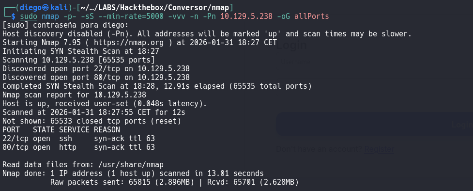
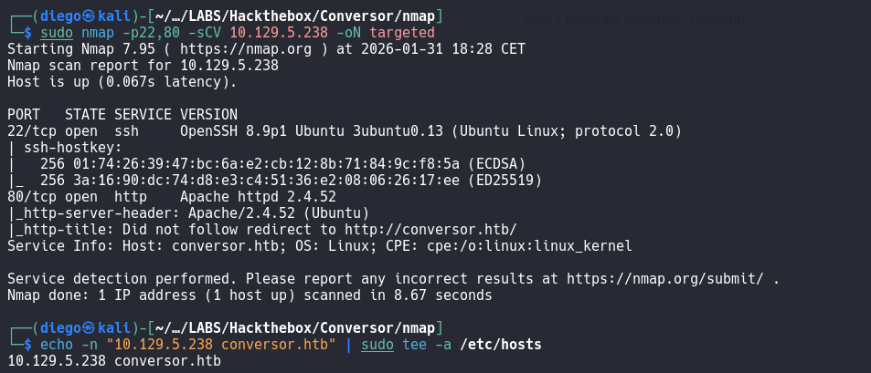
pasamos a la web
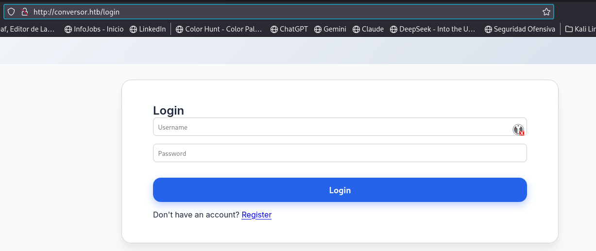
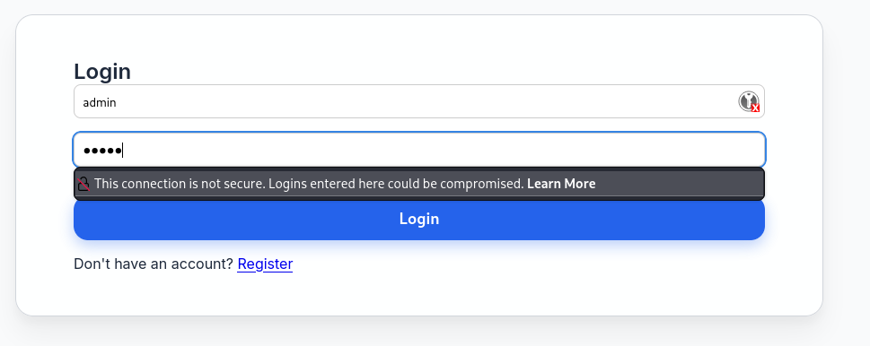
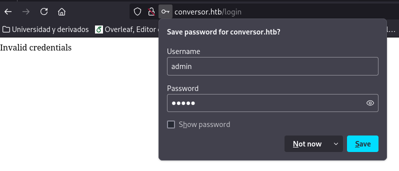
nos registramos puesto que no conocemos creds para entrar y nos da la opción, a ver si así nos deja ver qué más hay en la web
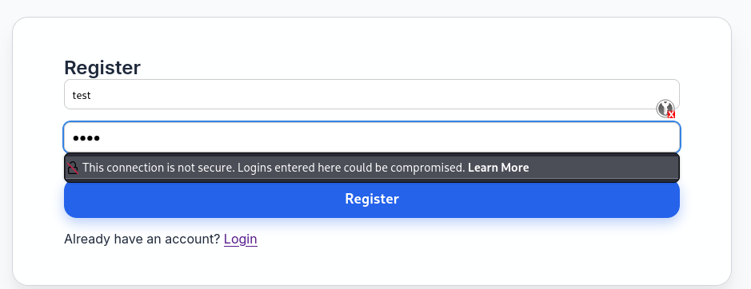
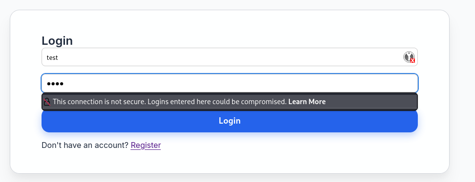
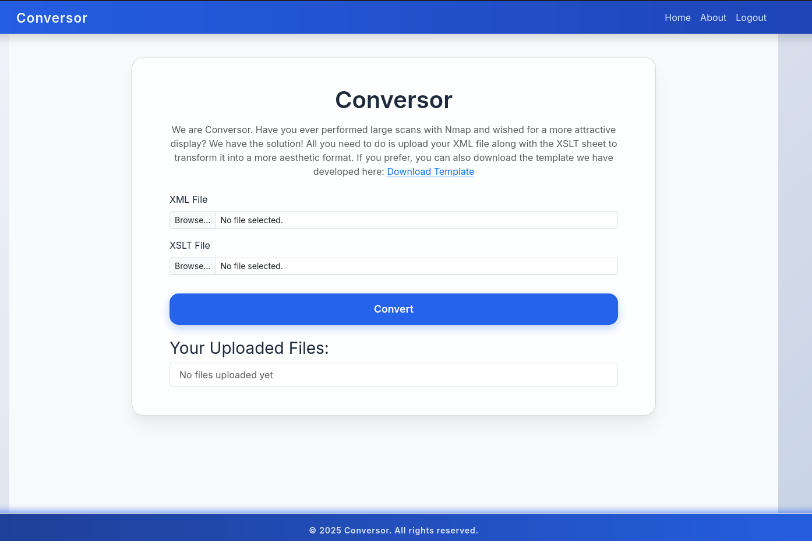
subir archivos? da que pensar
- verifica el tipo de archivo que subimos?
- lo interpreta?
- eso de la template qué es?
	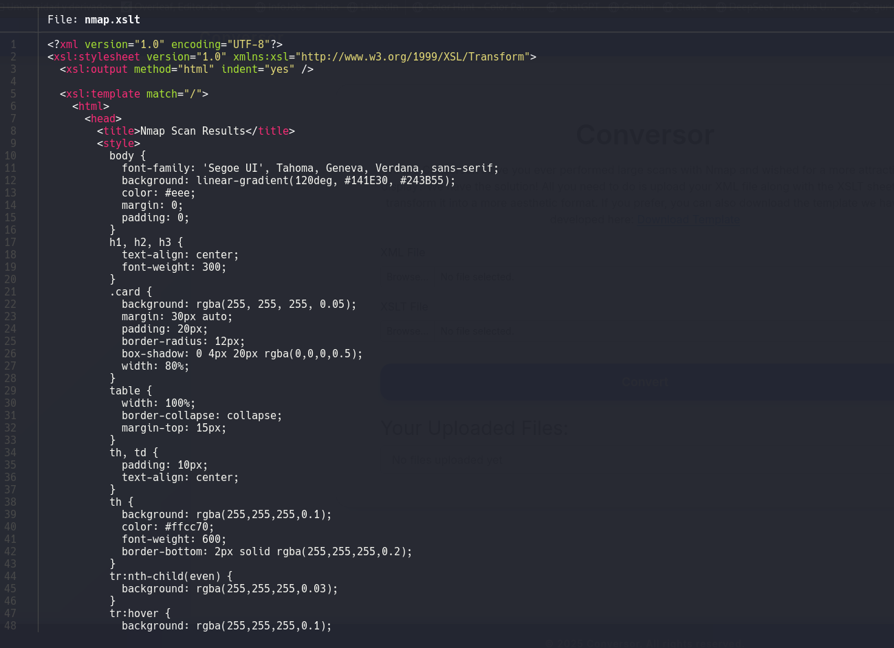
he probado a subir la template a los dos campos y me ha dado esto:
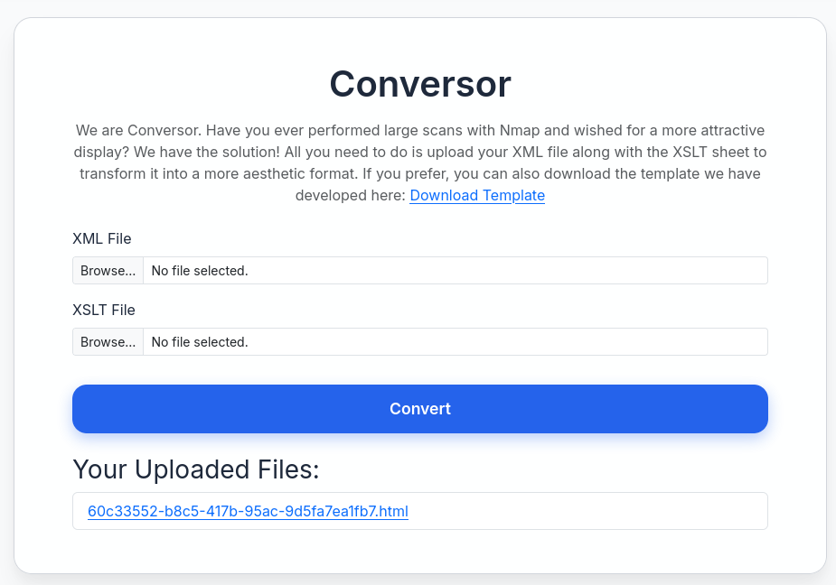
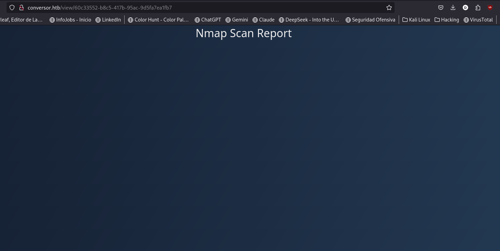
por si hubiera contenido visible he probado a ver la ruta pero no lo parece
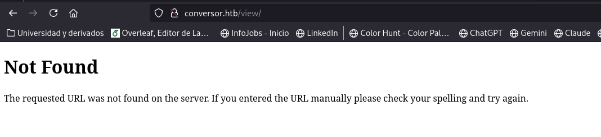
y si lo vuelvo a subir? Crea otro archivo
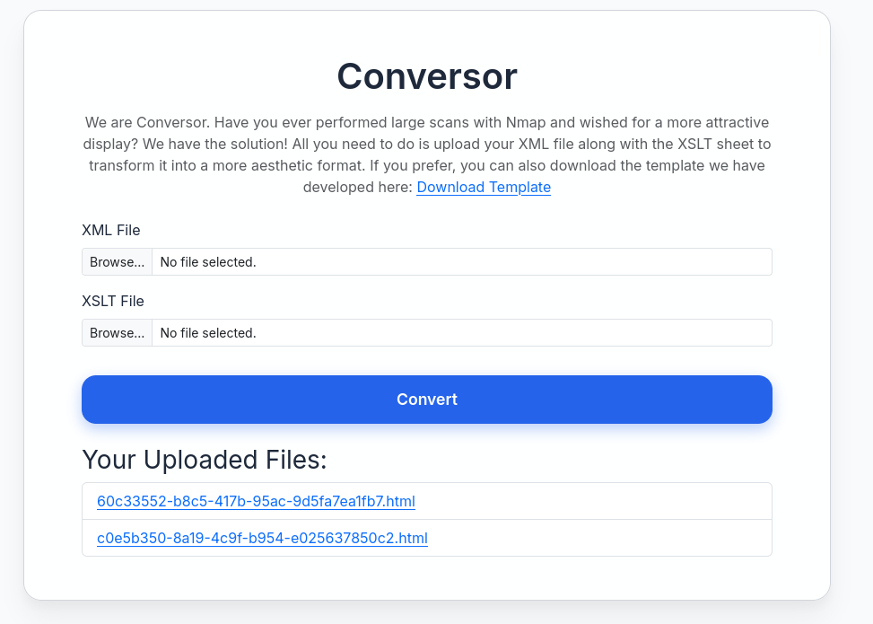
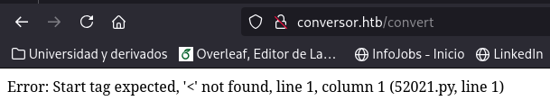 --> esto aparece al intentar subir un .py en el campo de en cualquier de los campos
hablando con chatgpt he averiguado qué: 

> [!NOTE]
> XSLT es donde suele estar el premio 🎁
> Aquí es donde los CTF suelen sonreír.
> Por qué XSLT es peligroso
> XSLT **no es solo plantillas**, es:
> - Un **lenguaje**
> - Con **funciones**
> - Que puede:
> 	- Acceder a documentos
>     - Llamar extensiones
>     - En algunos motores… **interactuar con el sistema**

he buscado posibles payloads y este me brindaba información:

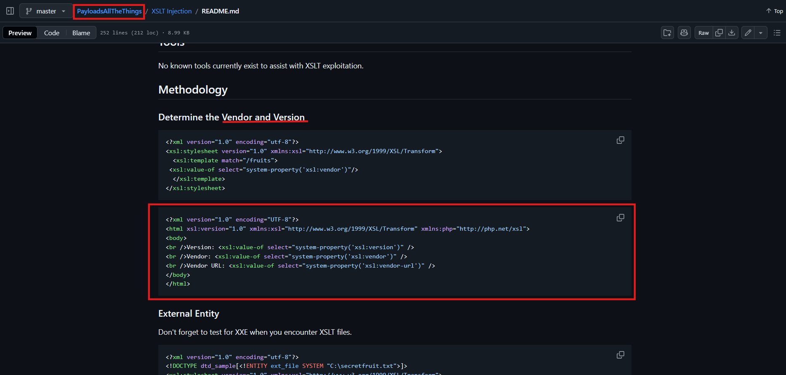

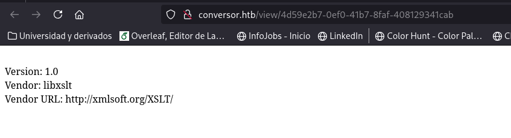
ahora bien, tenemos que conseguir la reverse shell: he visto que el payload de intentar llamar a un archivo interno mío no funciona, por lo menos el que había en payloadallthings. 
También si nos fijamos: 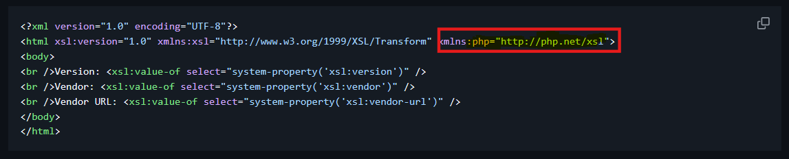
lo que hay por detrás parece php, osea que vamos enfocando un poco más, sobre cómo deberá interpretarse la reverse shell, pero falta conseguir "subirla" y que se ejecute. Pero por otro lado, despúes de haber probado con gobuster posibles directorios ocultos descubrimos que existía /about, el cual desvelaba el código fuente de la aplicación y, al revisarlo vemos que claramente lo que se utilizaba por detrás era PYTHON y no php.
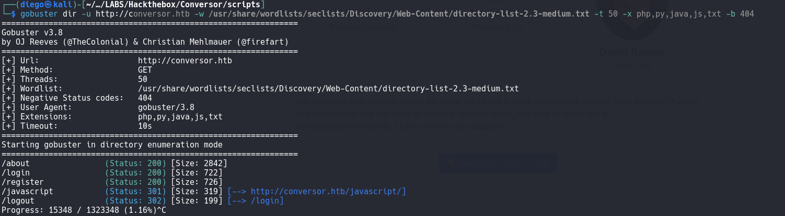

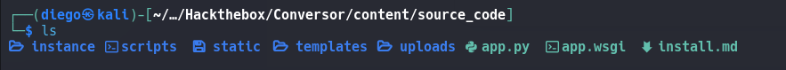

hemos probado con este script que me ha dado deepseck para ver posibles funciones disponibles:
```xml
<?xml version="1.0" encoding="UTF-8"?>
<xsl:stylesheet version="1.0" xmlns:xsl="http://www.w3.org/1999/XSL/Transform">
  <xsl:output method="html" indent="yes" />

  <xsl:template match="/">
    <html>
      <head>
        <title>XSLT Environment</title>
        <style>
          body { background: #222; color: #ddd; }
          .info { background: #333; padding: 10px; margin: 5px; }
        </style>
      </head>
      <body>
        <h1>XSLT Processor Info</h1>
        
        <div class="info">
          <strong>Vendor:</strong> <xsl:value-of select="system-property('xsl:vendor')"/>
        </div>
        
        <div class="info">
          <strong>Version:</strong> <xsl:value-of select="system-property('xsl:version')"/>
        </div>
        
        <div class="info">
          <strong>Vendor URL:</strong> <xsl:value-of select="system-property('xsl:vendor-url')"/>
        </div>
        
        <div class="info">
          <strong>Product Name:</strong> <xsl:value-of select="system-property('xsl:product-name')"/>
        </div>
        
        <div class="info">
          <strong>Product Version:</strong> <xsl:value-of select="system-property('xsl:product-version')"/>
        </div>
        
        <h2>Available Functions Test:</h2>
        <div class="info">
          <strong>unparsed-text() test:</strong> 
          <xsl:value-of select="function-available('unparsed-text')"/>
        </div>
        
        <div class="info">
          <strong>document() test:</strong> 
          <xsl:value-of select="function-available('document')"/>
        </div>
      </body>
    </html>
  </xsl:template>
</xsl:stylesheet>
```
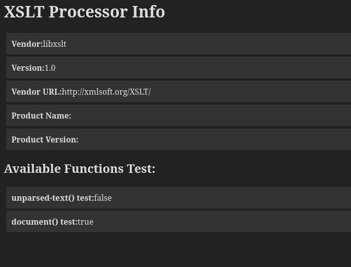
buscando posibles exploits de xslt injection en python encontré este: https://github.com/ex-cal1bur/XSLT-Injection_reverse-shell/tree/main
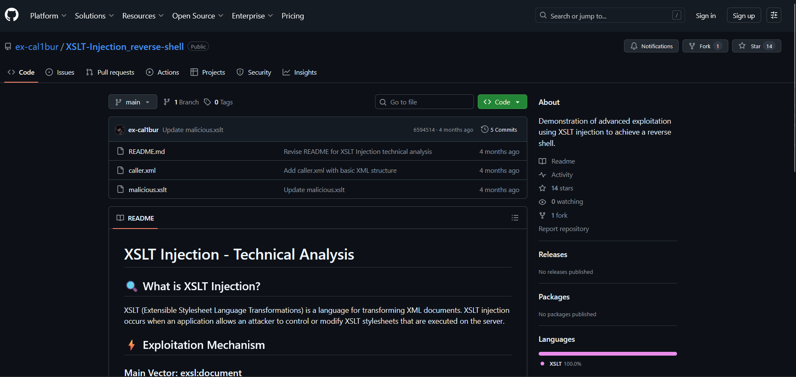
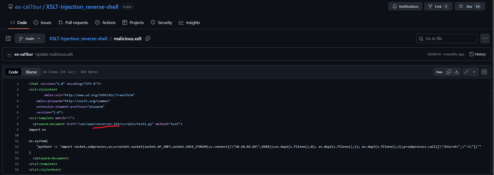
iba a funcionar porque se había hecho para esta máquina aunque aún queda investigar el por qué funciona y cómo se dieron cuenta de que sería así la manera, quiero entender el proceso mental de quien lo creó.

## Qué está haciendo realmente ese XSLT
El elemento clave es este:
```xml
<ptswarm:document href="/var/www/conversor.htb/scripts/test2.py" method="text">
```
Eso **NO es XSLT estándar**.
Eso es una **extensión**.
En libxslt existen extensiones EXSLT que permiten crear archivos durante la transformación.  
El elemento real se llama normalmente:
```
exsl:document
```
Pero aquí lo han declarado así:
```xml
xmlns:ptswarm="http://exslt.org/common"
extension-element-prefixes="ptswarm"
```
O sea:
- Está usando el namespace de EXSLT.
- Pero lo ha llamado `ptswarm`.
Eso es solo un alias. El namespace es lo importante.
## Por qué funciona en TU código
Mira tu backend:
```python
xslt_tree = etree.parse(xslt_path)
transform = etree.XSLT(xslt_tree)
result_tree = transform(xml_tree)
```
No hay:
```python
etree.XSLTAccessControl(...)
```
En lxml, si no defines `access_control`, el comportamiento por defecto es PERMISIVO.
Eso significa:
- Puede leer archivos 
- Puede escribir archivos
- Puede usar extensiones EXSLT
Entonces cuando el transformador procesa:
```xml
<ptswarm:document href="/var/www/conversor.htb/scripts/test2.py">
```
libxslt crea realmente ese archivo en el sistema.
No es magia.  
No es RCE directa.  
Es el propio motor XSLT escribiendo el archivo.
El proceso que ejecuta Flask tiene permisos sobre `/var/www/conversor.htb/`.
Así que lo crea.
## Cómo pensó esto quien lo resolvió
El razonamiento fue algo así:
### Paso 1 — Veo que usan lxml
→ Sé que debajo está libxslt.
### Paso 2 — Veo que no usan XSLTAccessControl
→ Eso significa que EXSLT puede estar activo.
### Paso 3 — Busco qué extensiones soporta libxslt
libxslt soporta:
- exsl:document → escribir archivos 

Eso es conocido y está documentado.
### Paso 4 — Si puedo escribir archivos…
Entonces me pregunto:
¿Dónde puedo escribir?
Viendo el código:
```
/var/www/conversor.htb/
```
Y probablemente exista:
```
/var/www/conversor.htb/scripts/
```
Y si esa carpeta está dentro del entorno ejecutable…
Ya tienes ejecución indirecta.

dicho esto 
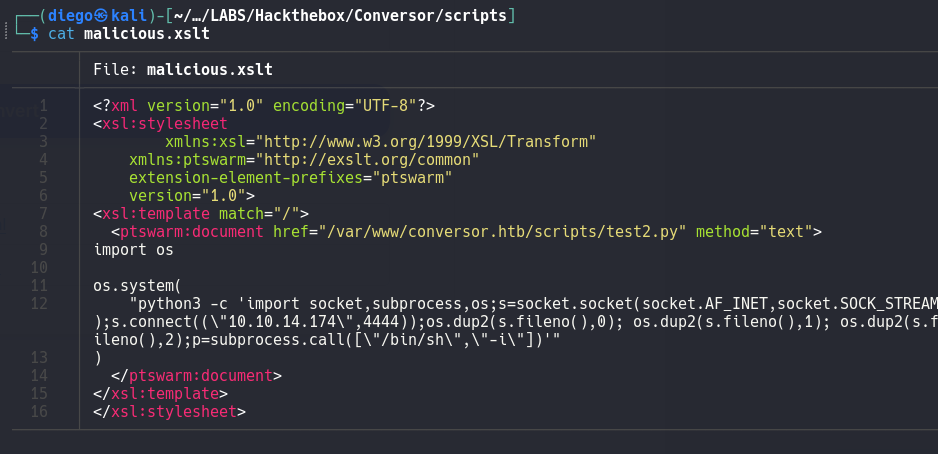
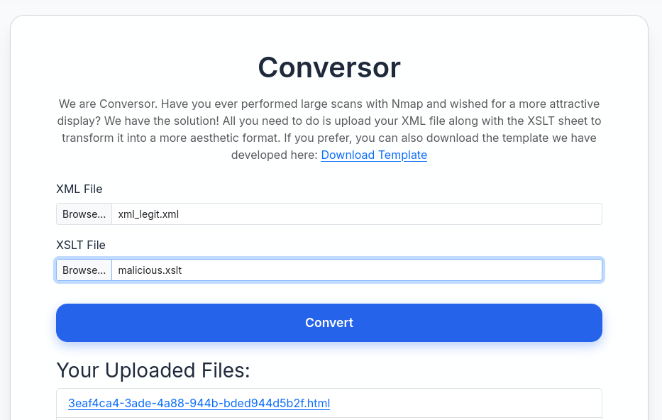
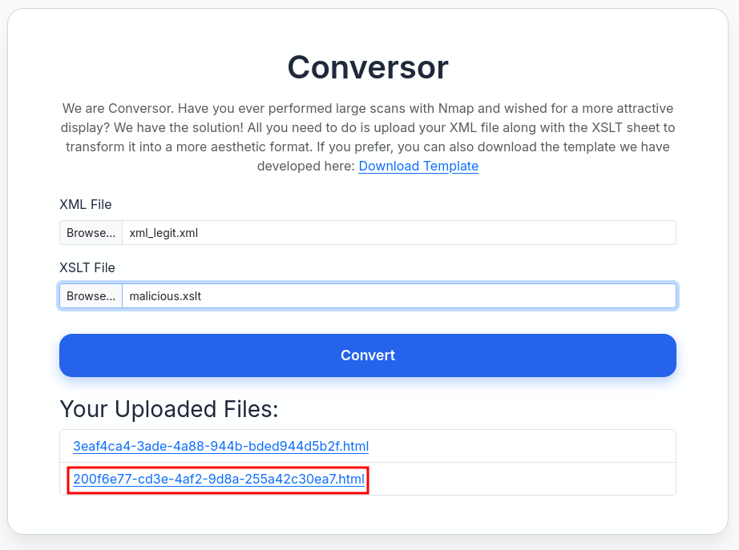
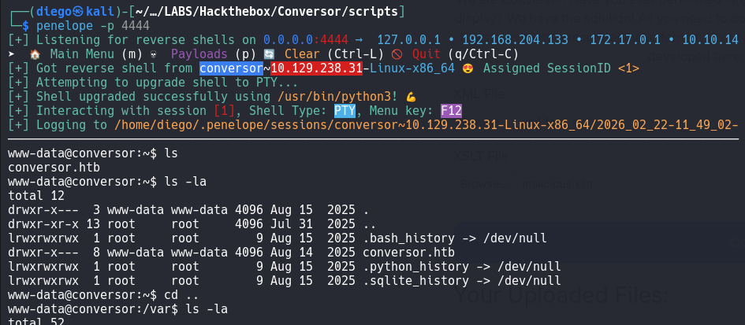
tras revisar el home y ver que solo hay un user, por lo que la flag la tendrá él, ya que además probé a buscar un archivo user.txt legible con www-data que es el usuario que tienes al entrar y no había, me acordé de la bbdd que tenía la aplicación y que desde fuera no era realmente accesible porque no mostraba nada, así que la abrí ahora:
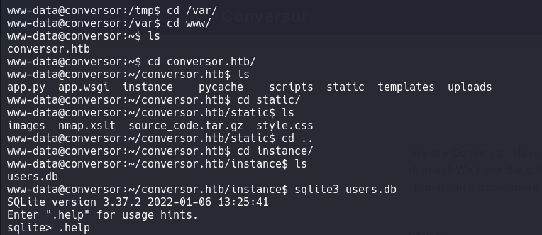
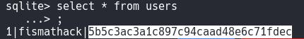
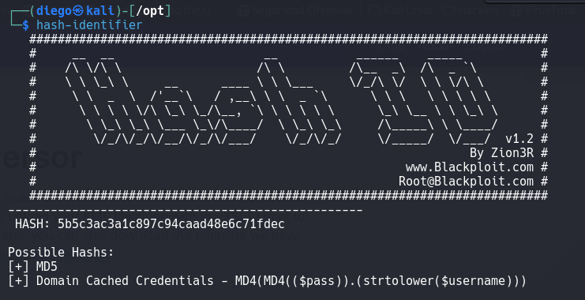
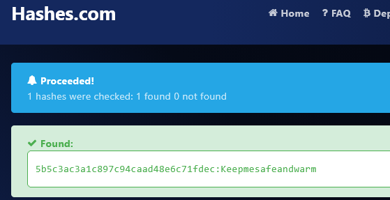
`5b5c3ac3a1c897c94caad48e6c71fdec:Keepmesafeandwarm`

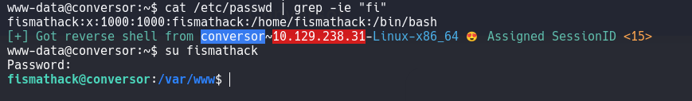

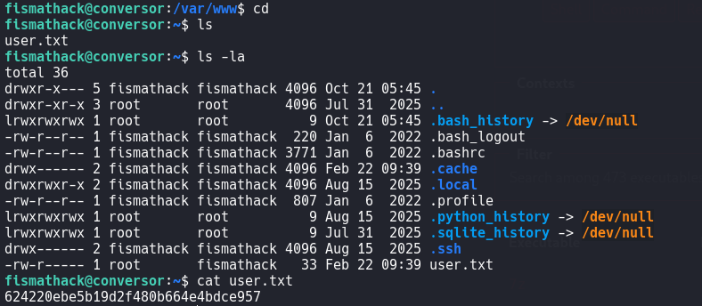
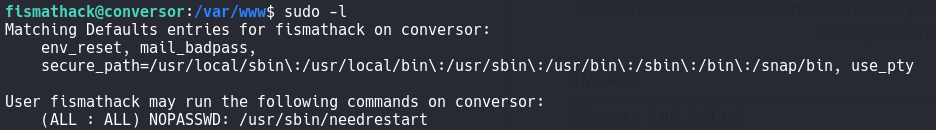

Para escalar he encontrado:
[https://github.com/o-sec/CVE-2024-48990/blob/main/poc.sh](https://github.com/o-sec/CVE-2024-48990)
modifiqué el script
 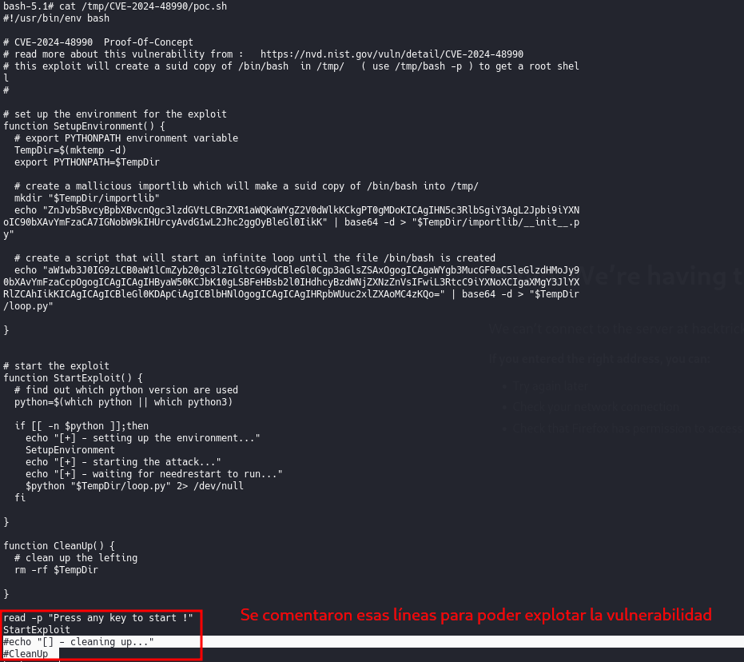
 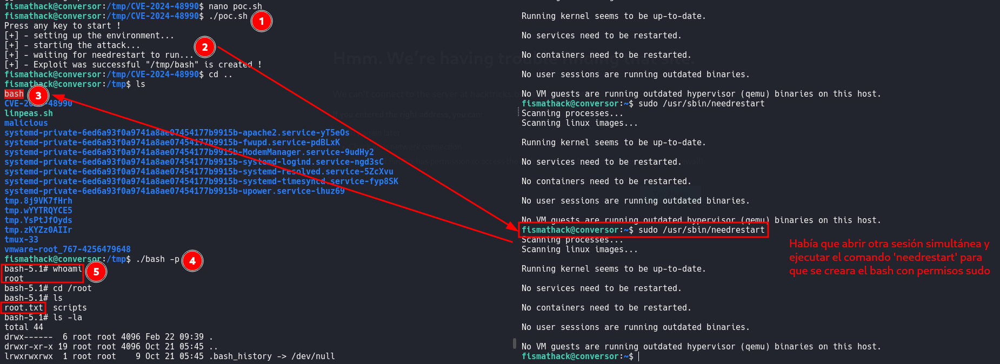
 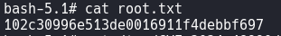
 