nmap
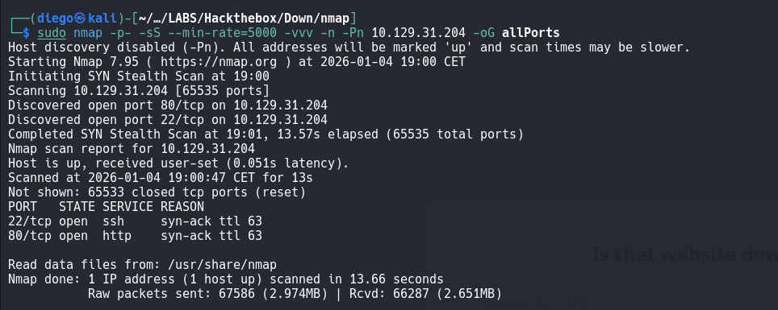
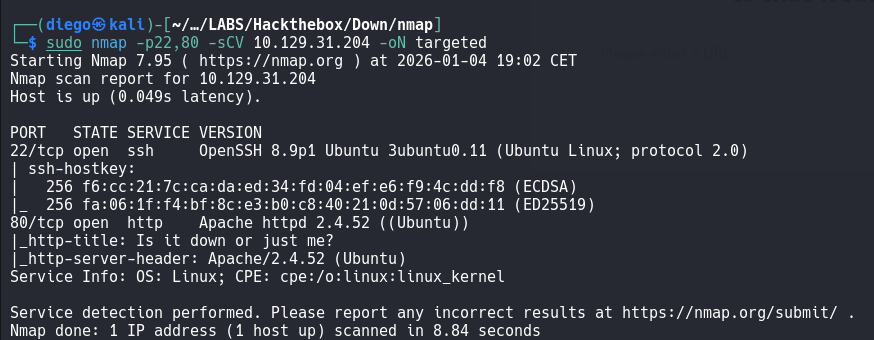

vamos a empezar por la página web visto lo poco que hay y la versión del SSH que es bastante nueva
WEB:
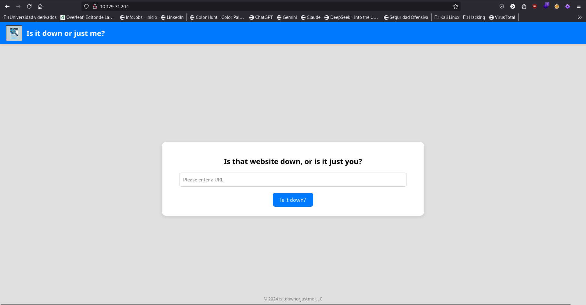
codigo fuente escaso e insignificante --> 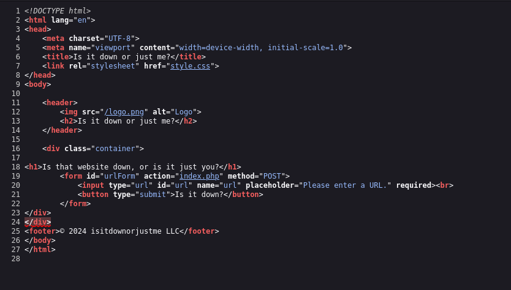
voy a buscar subdirectorios antes de mirar en sí las funciones que pueda tener la web y empezar con burpsuite y demás. Ffuf -->  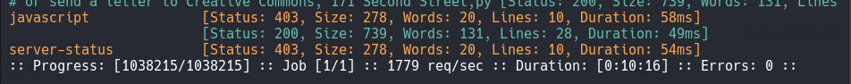 nada útil

Al parecer al indicarle una URL analiza si la página está o no activa para todo el mundo y eres tú el que falla y na la ve, para lo cual devuelve el código fuente de la página indicada
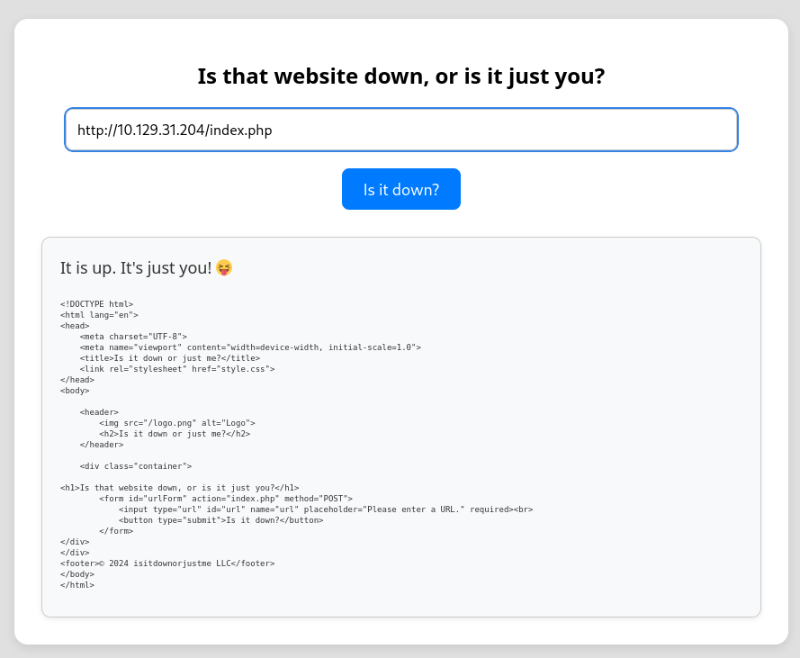
analizando a ver si hay algo curioso por detrás esto es lo que veo de primeras: 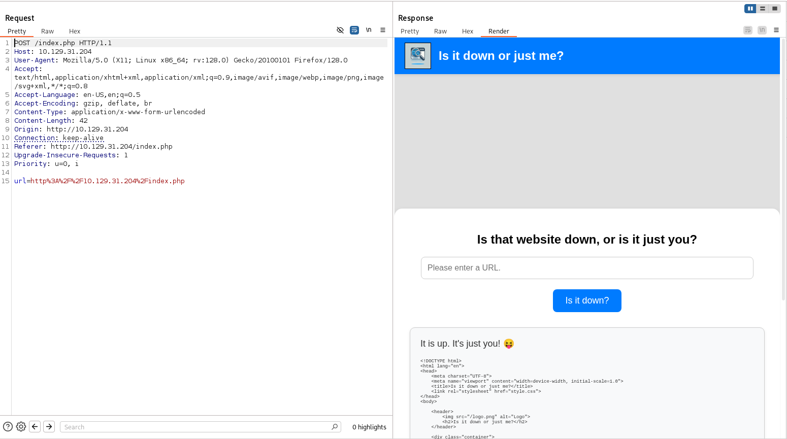
he probado a inyectar código por si fuera algún tipo de petición curl pero no funciona --> 
- 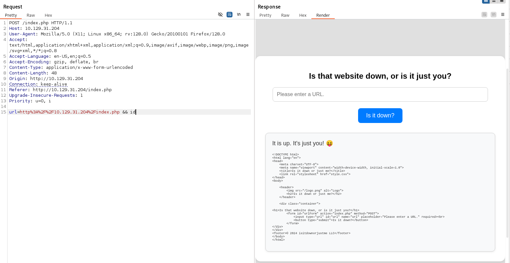
- 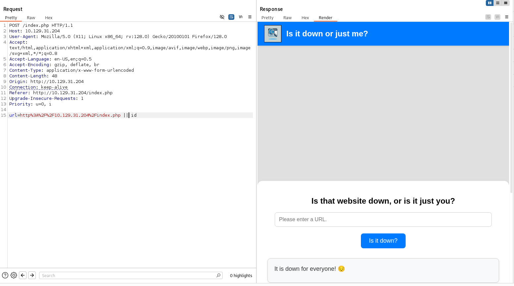
- 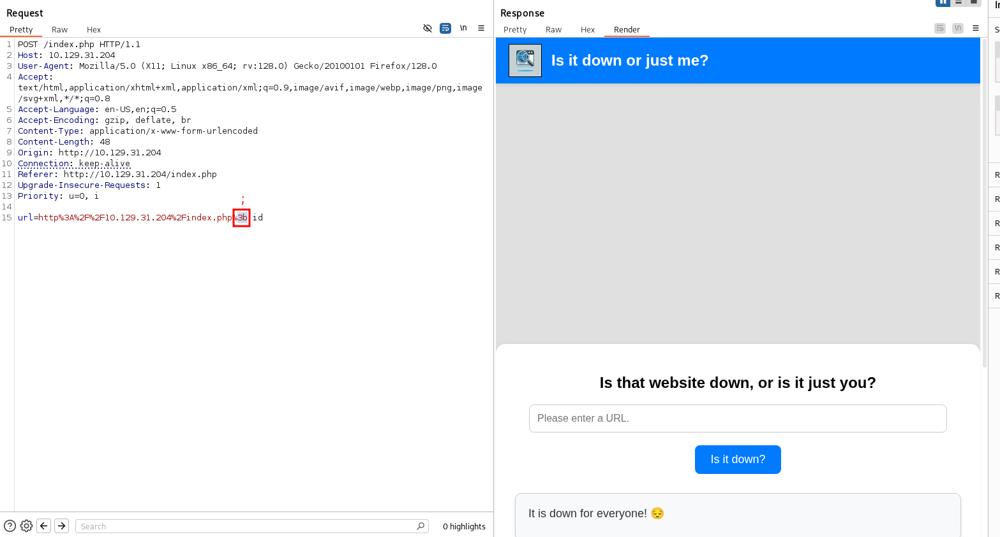

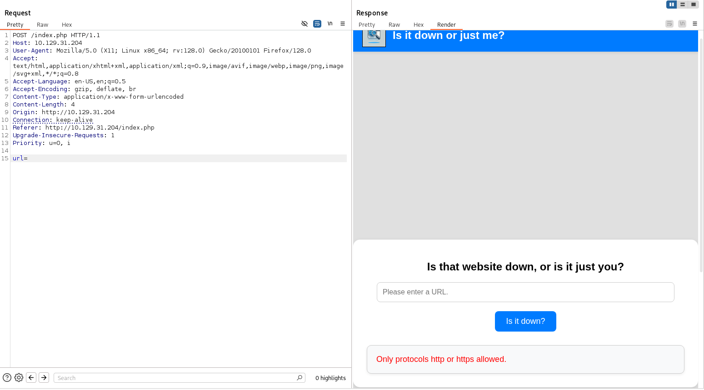 al ver la respueta ante no poner nada he pensado que podría crear un servidor remoto con python y ver si llegan las peticiones? `python3 -m http.server 80`

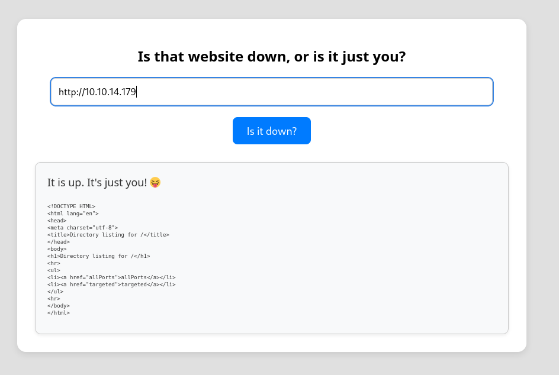
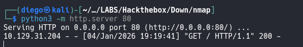

como había visto que en mi server mostraba como los ficheros de la carpeta en la que estaba he probado a ver si podía ver algún fichero de la máquina víctima --> 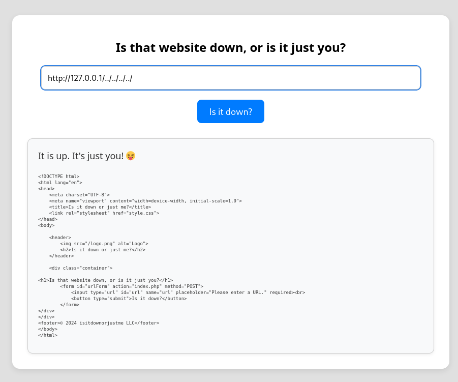

vale, en vista de que lo probado no me estaba llevando a nada he mirado uno de los pasos del guided de la máquina y precisamente me ha dicho que mirara el user agent de la respueta de la petición POST, es decir, del GET que hace mi servidor cuando recibe el POST.
Para esto hay que usar wireshar, netcat o algún script personalizado porque el servidor python en sí mismo que había creado no da mucha información.
> pequeño script que herede de `BaseHTTPRequestHandler`. Esto te permitirá imprimir todos los encabezados (incluido el User-Agent) en la terminal:
> Python
> ```python
> from http.server import HTTPServer, BaseHTTPRequestHandler
> class RequestHandler(BaseHTTPRequestHandler):
> 	def do_GET(self):
>            print(f"\n[+] Petición GET recibida de {self.client_address}")
>            print(self.headers) # Aquí se imprimen todos los headers
>            self.send_response(200)
>            self.end_headers()
> 	def do_POST(self):
> 		content_length = int(self.headers['Content-Length'])
> 		post_data = self.rfile.read(content_length)
> 		print(f"\n[+] Petición POST recibida de {self.client_address}")
> 		print(self.headers)
> 		print(f"BODY: {post_data.decode('utf-8')}")
> 		self.send_response(200)
> 		self.end_headers()
> 	server = HTTPServer(('0.0.0.0', 80), RequestHandler)
> 	print("Servidor escuchando en el puerto 80...")
> 	server.serve_forever() 
>```

Netcat (`nc`) la herramienta más rápida y directa para ver una petición "cruda" (_raw_) sin usar Wireshark es **Netcat**.
```bash
sudo nc -lvnp 80
```

Si prefieres no detener tu servidor de Python pero quieres ver los datos sin la interfaz gráfica de Wireshark, puedes usar `tcpdump`:
```bash
sudo tcpdump -i eth0 -A port 80
```
- `-i eth0`: La interfaz de red (cámbiala si es necesario).
- `-A`: Muestra el contenido en formato ASCII (legible).
- `port 80`: Filtra solo el tráfico de tu servidor.
    
Ver que el User-Agent es `curl` te da pistas sobre cómo está programada la web vulnerable:
- Si el `curl` incluye una versión antigua, podrías buscar vulnerabilidades específicas de esa versión.
- Si estás intentando un **RCE** mediante el campo POST, saber que el servidor usa `curl` internamente para procesar tu entrada te confirma que probablemente hay una ejecución de comando tipo `os.system("curl " + url)`.

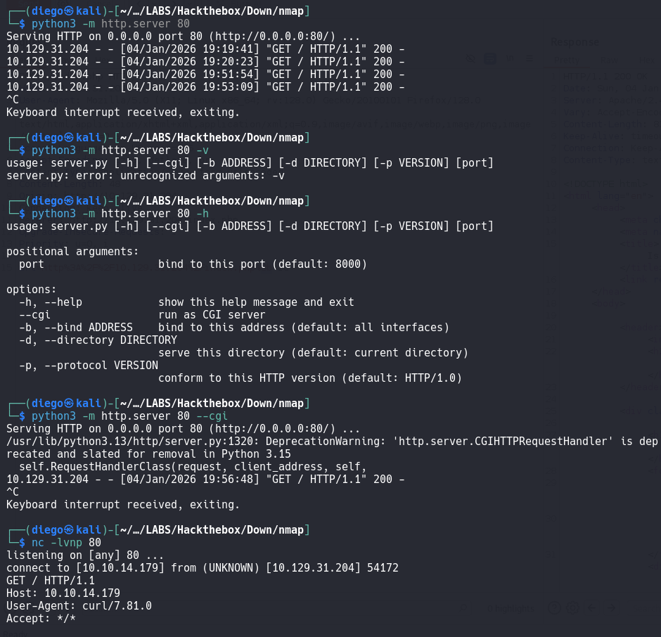
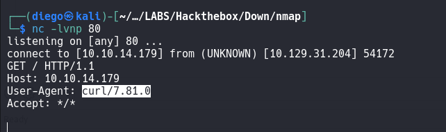 --> 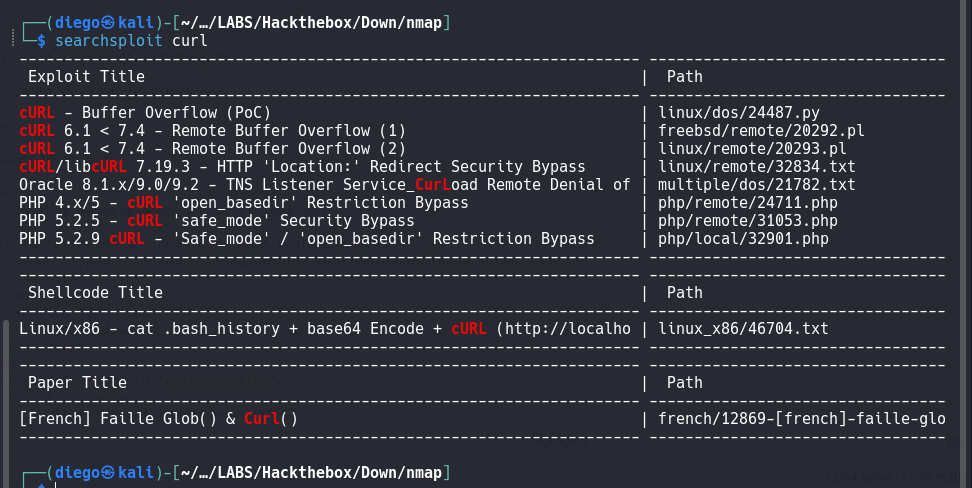 no parece ser vulnerable la versión, así que el camino en verdad es el que estaba diciendo antes, ejecución de comandos, de alguna forma vamos a tener que encadenar alguno

