#
##

nmap 
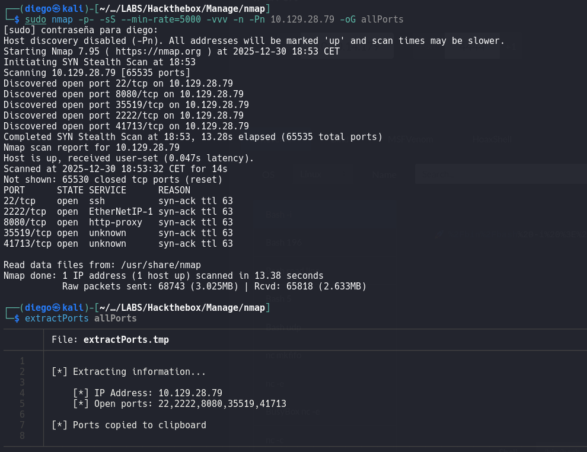
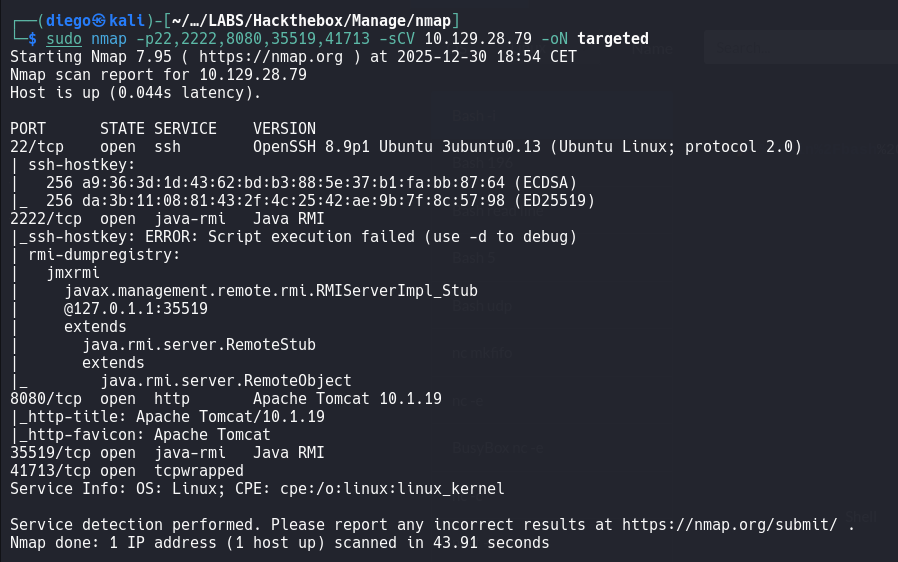

en vista de los puertos que hay, como no conozco esos servicios y tecnologías voy a empezar mirando el tema del proxy, por si hubiese una web o información o algo así
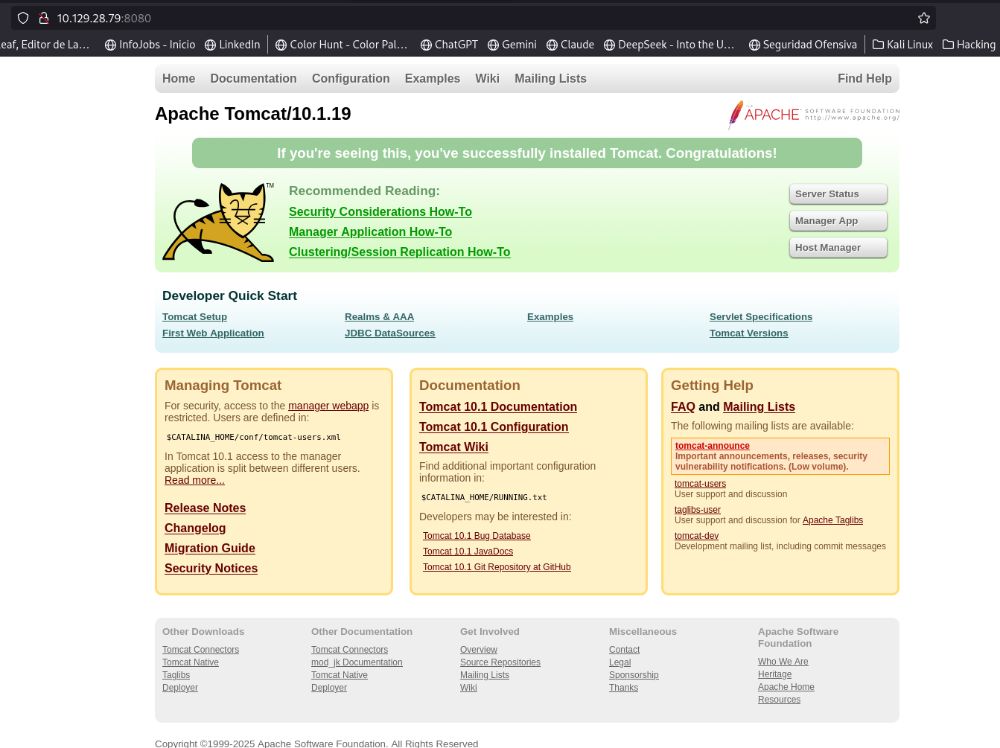
parece la default de apache tomcat, investigar a ver si hay alguna otra ruta accesible --> 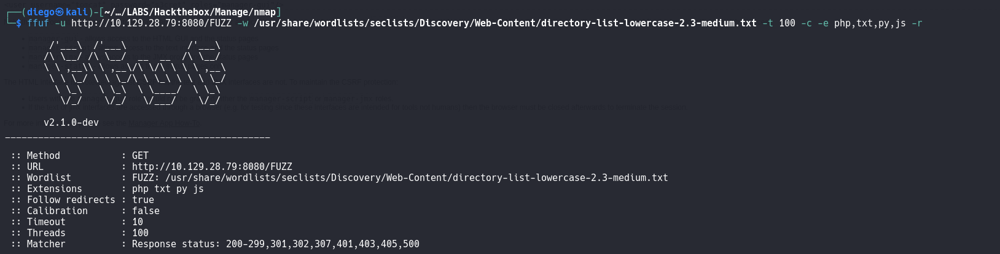 se han encontrado 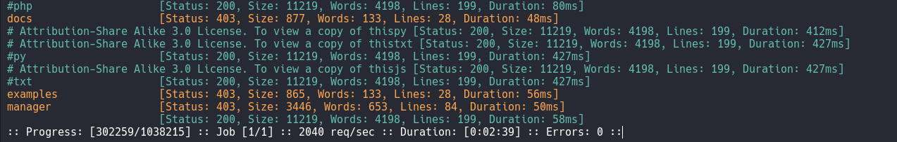
- 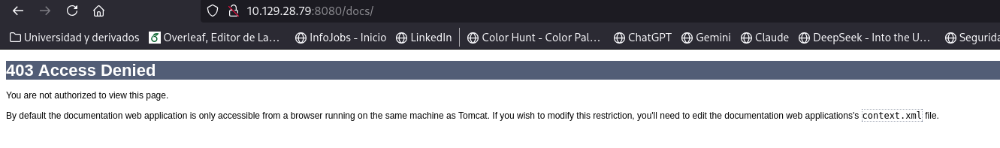
- 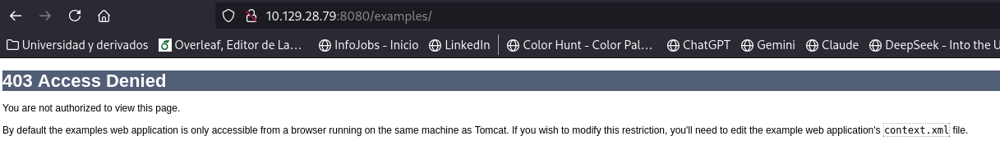
- 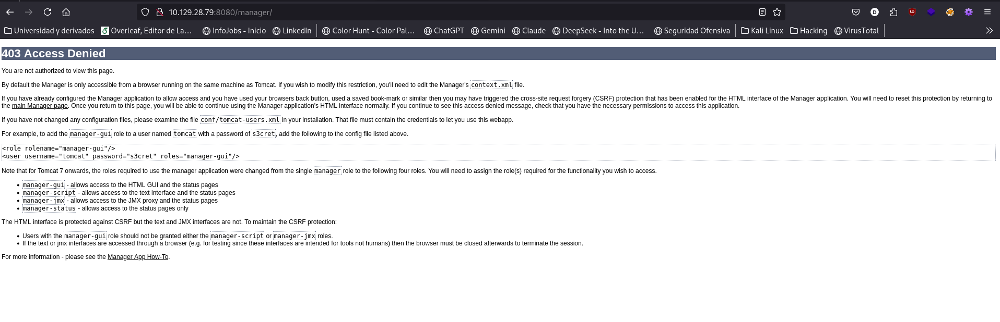

visto lo visto y habiendo examinado posibles subrutas que vinieran de la de /manager sin éxito toca volver a los otros servicios abiertos. Evidentemente el que llama la atención es Java-RMI. Respecto al scan de nmap decir:
La pista MÁS importante del scan (muchos la pasan por alto) --> `2222/tcp open  java-rmi | rmi-dumpregistry: |   jmxrmi |     javax.management.remote.rmi.RMIServerImpl_Stub |     @127.0.1.1:35519`
Esto significa, en humano:
- Hay **JMX** expuesto
- Usa **RMI**
- Redirige a **otro puerto RMI interno (35519)** --> que es además de los que salen en el escaneo.

Ahora bien, la pregunta del millón --> cómo uso/exploto esto?

---
### Java-RMI
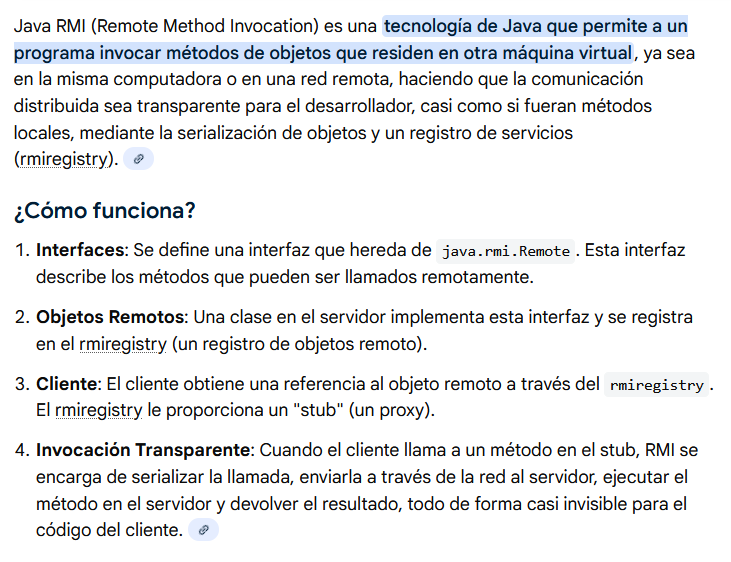
### JMX
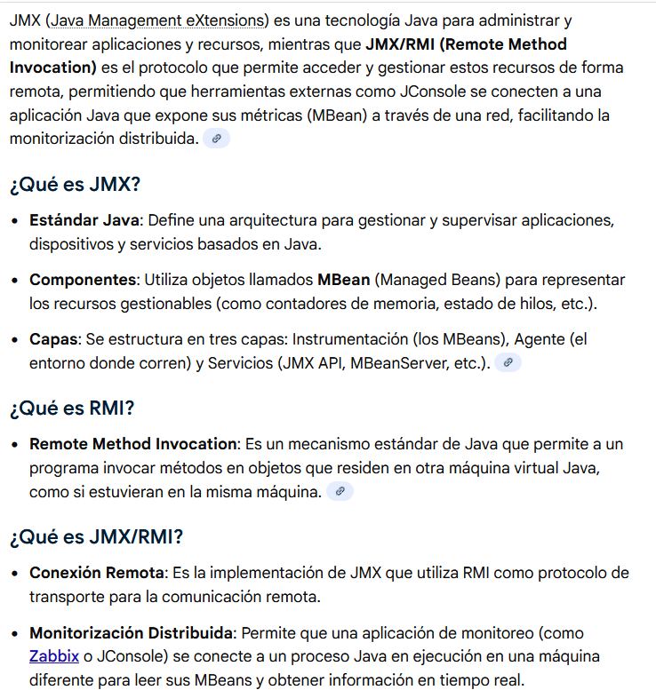

---

buscando acerca de este servicio/tecnología entre la IA y google he descubierto jmxterm
he intentado conectarme como he ido buscando en google y chatgpt, gemini y demás --> 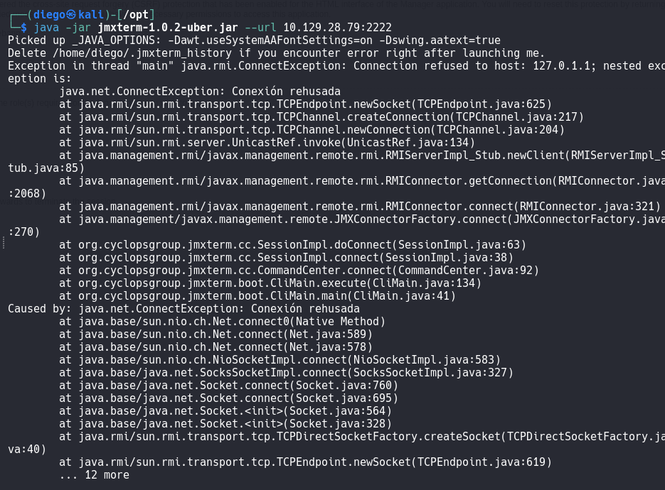 pero no ha sido útil ni en ese puerto ni en el 35519

Vale, despúes de unos días de descanso he retomado esta máquina con la idea clara de que me faltaba algo de Tomcat porque la siguiente pregunta del guide mode decía que encontrara la contraseña de un user, así que empecé revisando todos los enlaces de la web, pero no me llevaron a nada, así que tuve que mirar la pista, que era esta:
> Enumerate the Java RMI service with a tool like BeanShooter. It can dump users and their passwords.

Sin saber de la tecnología RMI y mucho menos de JMX dentro de esta lo primero que tendría que haber hecho era informarme más, mucho más, y pensar en el primer paso lógico, enumerar, queremos obtener información de estos servicios en la máquina, más que explotarlos directamente.
Así que evidentemente haciendo caso a la pista y con otras herramientas me puse a enumerar RMI y JMX. Empecé enumerando RMI con _remote-method_guesses_ como herramienta, que precisamente detectó.
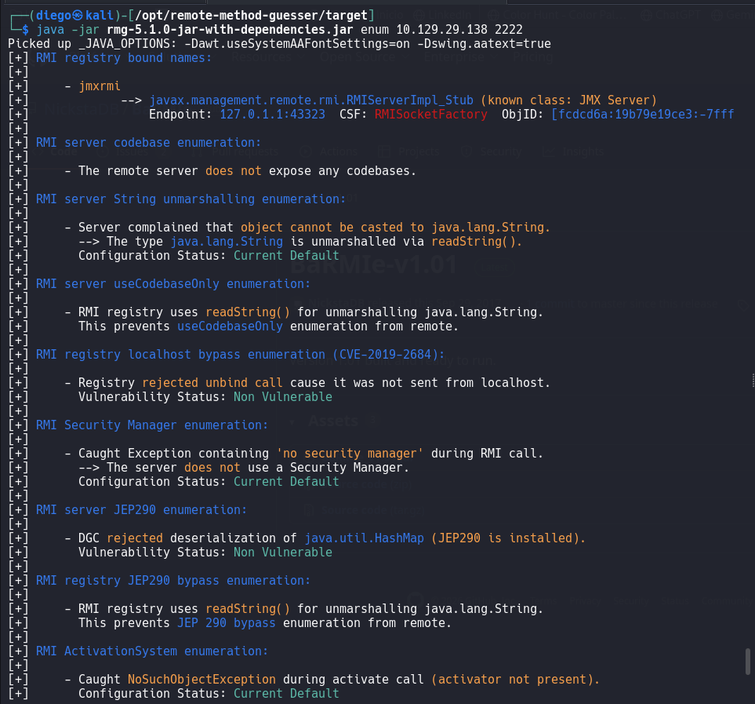
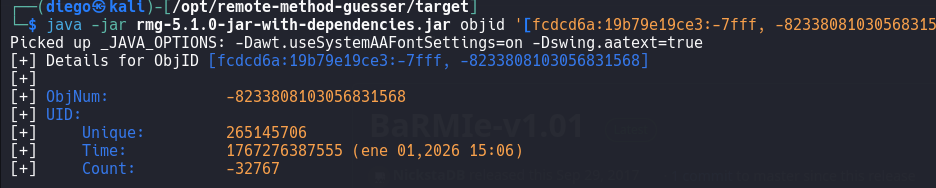
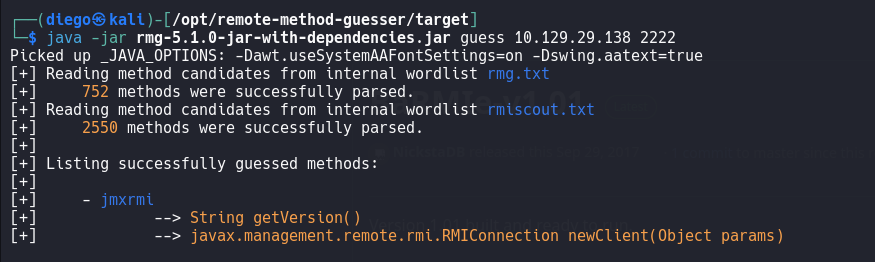
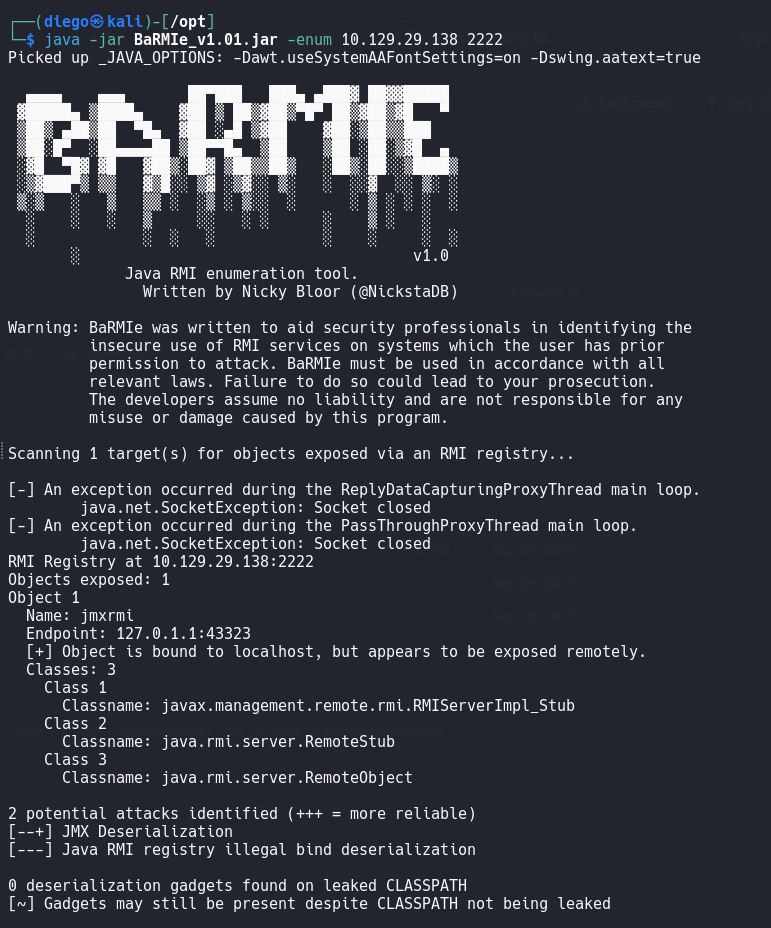

---
---
---
```bash
java -jar rmg-5.1.0-jar-with-dependencies.jar enum 10.129.29.138 2222
```

NO estás “lanzando un exploit”. Estás haciendo esto:
> “Voy a hablar con un **servicio Java remoto** usando **el protocolo RMI**,  
> y voy a preguntarle **qué objetos Java remotos existen y cómo están configurados**.”

En Java, cuando una aplicación quiere exponer objetos remotamente:
1. Arranca un **RMI Registry**
2. Registra objetos con un **nombre**
3. Los clientes preguntan:
    > “¿Qué nombres tienes?”
4. El registry responde con **referencias a objetos Java**

Analogía perfecta:

| Mundo real        | Java         |     |
| ----------------- | ------------ | --- |
| DNS               | RMI Registry |     |
| Nombre de dominio | Nombre RMI   |     |
| IP/puerto         | Stub remoto  |     | 

El subcomando `enum` hace **una batería de pruebas ordenadas**, todas con la misma idea:
> “Dime QUÉ expones y CÓMO lo expones”

RMG se conecta a:

```
10.129.29.138:2222
```

Y dice, literalmente (a nivel de protocolo):

> “Hola, soy un cliente RMI.  
> Dame la lista de nombres registrados.”

Si esto falla → no hay nada que hacer.  
Si funciona → **hay Java remoto expuesto**.

El registry responde:

```
jmxrmi
```

 `jmxrmi` es **estándar oficial de JMX**
Se sabe porque **JMX siempre se registra así por defecto**.

📌 En este punto ya sabes:

> “Esta aplicación Java expone su interfaz de administración”

Cuando RMG ve `jmxrmi`, hace lo siguiente:

> “Vale, dame el objeto Java asociado a ese nombre”

El registry responde con un **stub**:

```
javax.management.remote.rmi.RMIServerImpl_Stub
```

Esto significa:
- No es un objeto cualquiera
- Es la **implementación oficial del servidor JMX**
- Es el punto de entrada a **toda la gestión remota**

Después de ejecutar ese comando, deberías pensar algo como:

> “He descubierto un servicio Java  
> que expone su interfaz de administración (JMX)  
> sobre RMI, sin autenticación aparente  
> y sin sandbox.
> 
> El RMI en sí está parcheado,  
> pero JMX sigue siendo una superficie enorme.”

Eso es **pensar como pentester**, no como usuario de herramientas.

---
---
---


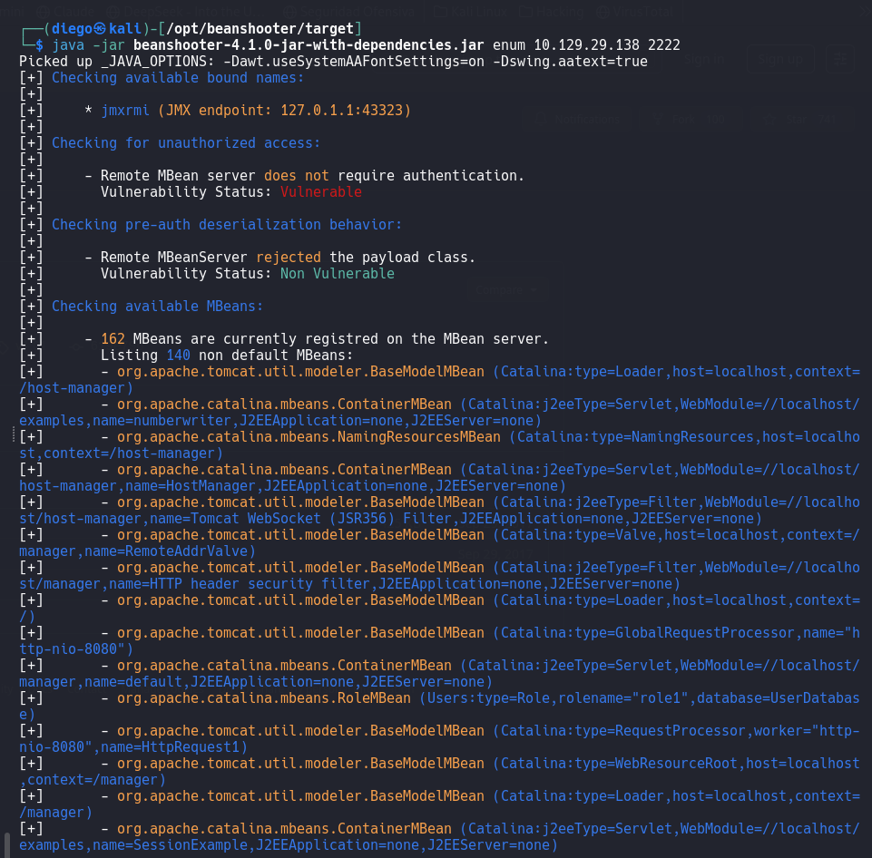
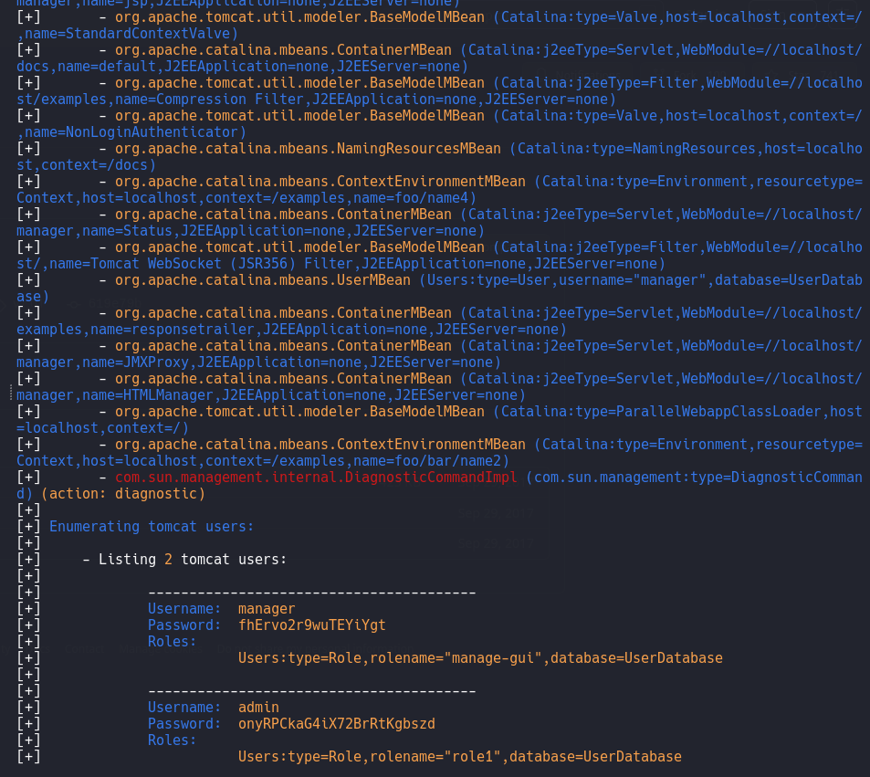
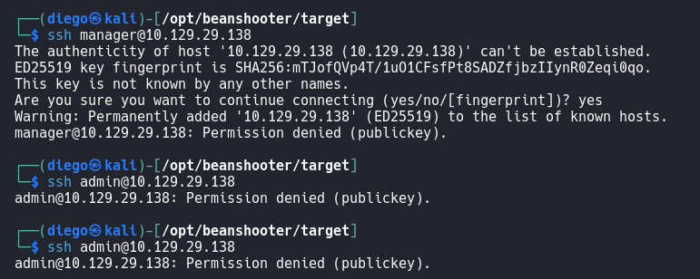


Having the tomcat passwords is nice (and I’ll come back to them later), but not actually necessary to get execution on Manage from here. `beanshooter` has a command `standard` that will deploy the StandardMBean, which will then upload the TonkaBean. With access to Tonka, I can run commands and get a shell on the system.

I’ll start with `standard`:
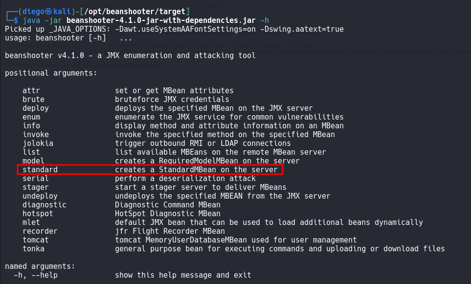
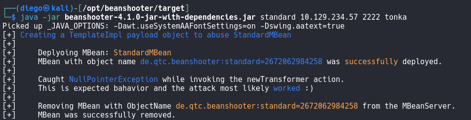

Now I’ll use the `tonka shell` command to get an interactive shell:
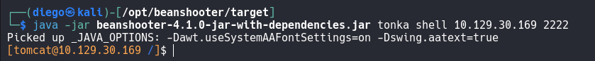
It’s not a full shell, but access to the Java `Runtime.exec` method. But that’s good enough.

`user.txt` is in the tomcat user’s home directory, `/opt/tomcat`:
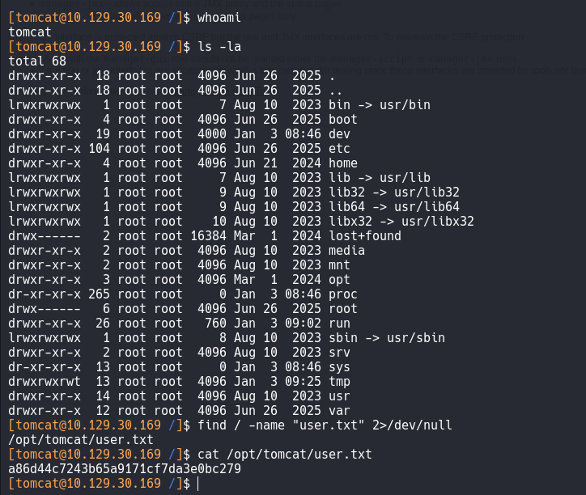

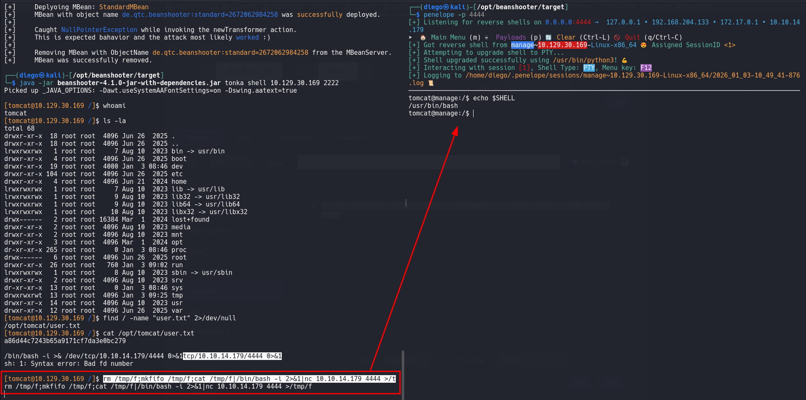
