## Information Gathering - WHOIS Enumeration OS Credentials:

#### Labs - Whois Enumeration

1. Start up the VM and perform a whois query against the **megacorpone.com** domain using VM's IP address as WHOIS server. What is the hostname of the third Megacorp One name server?

```bash
whois -h 192.168.56.101 megacorpone.com
```

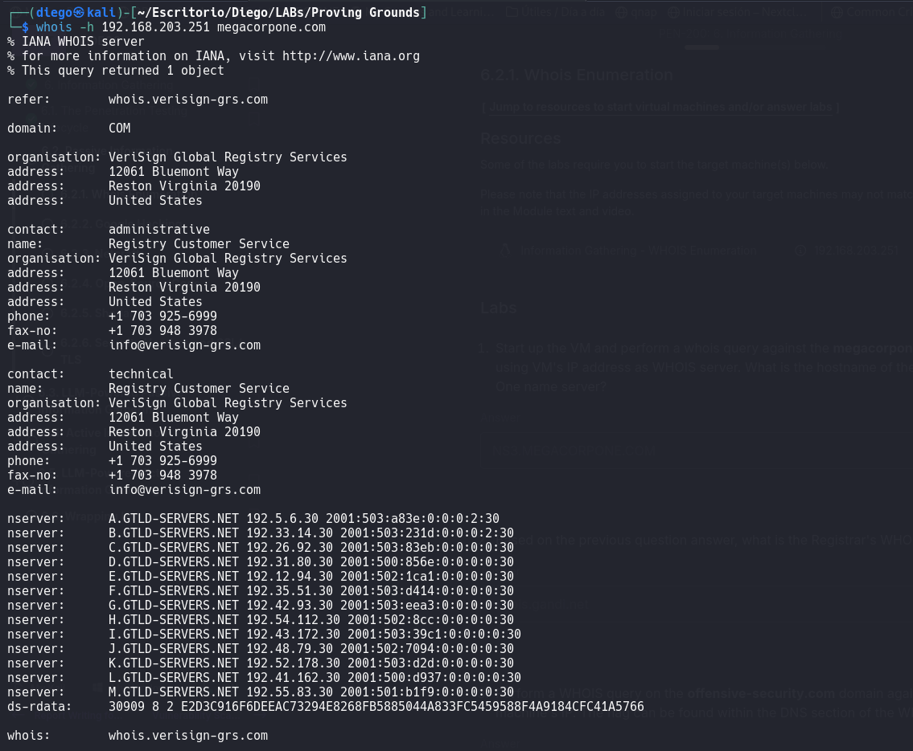
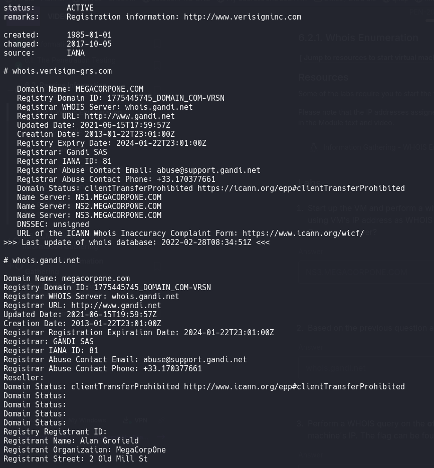
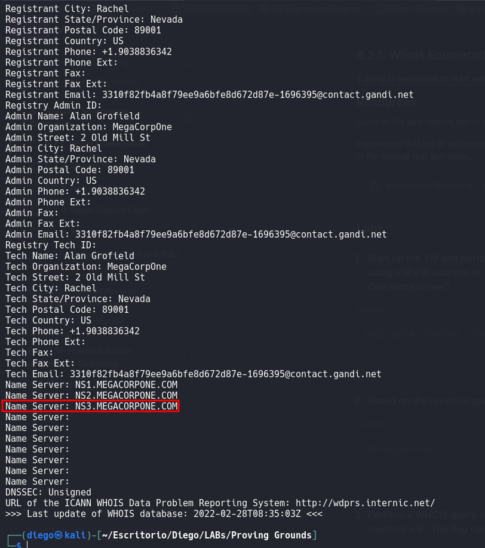

2. Based on the previous question answer, what is the Registrar's WHOIS server?

```bash
whois kali.org -h 192.168.203.251 | grep -ie "registrar"
```

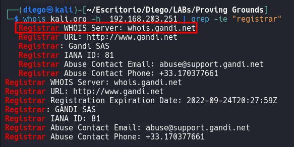

3. Perform a WHOIS query on the **offensive-security.com** domain against the machine's IP. The flag can be found within the DNS section of the WHOIS record.

```bash
whois -h 192.168.203.251 offensive-security.com | grep -ie "name"
```

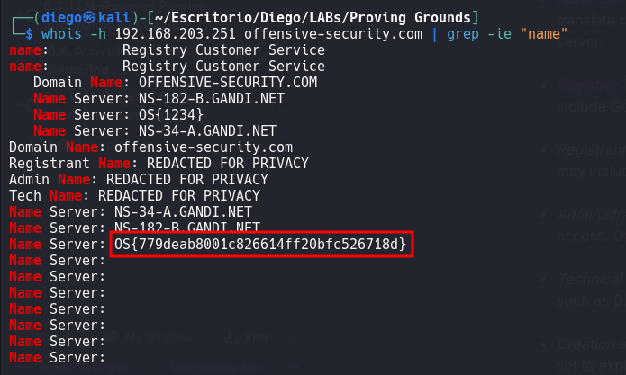

4. Perform a WHOIS query on the **kali.org** domain against the machine's IP. What's the Tech Email address?

```bash
whois -h 192.168.203.251 kali.org | grep -ie "tech"
```

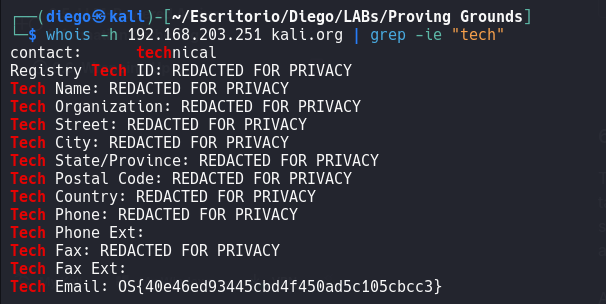

---
---

#### LABS - Google Hacking
1. What is the name of the VP of Legal for MegaCorp One?

```
site:megacorpone.com intext:legal
```

.png)
2. What is the email address of the VP of Legal for MegaCorp One?

- Simplemente busqué en la página, en la sección de equipo ejecutivo, y como ya conocía el nombre por la pregunta anterior conseguí el email:
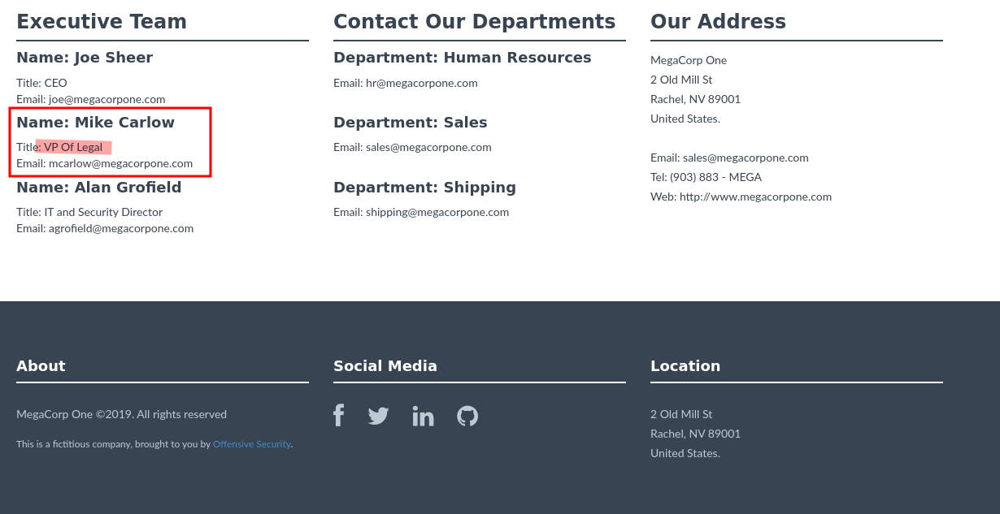
2. What other MegaCorp One employees can you identify that are not listed on **www.megacorpone.com**?

- Fue necesario buscar la empresa en la aplicación de Linkedin puesto que los nombrados en la página no se contemplaban.
- Al buscar la empresa hay un apartado para los negocios en Linkedin donde asocian empleados. En este caso había uno, probé y era la solución.
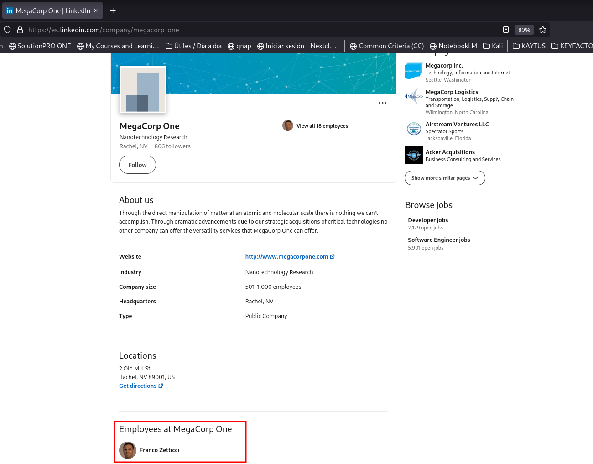

---
---
#### LABS - Netcraft

1. From your own Kali VM, use Netcraft to determine what application server is running on **www.megacorpone.com**.

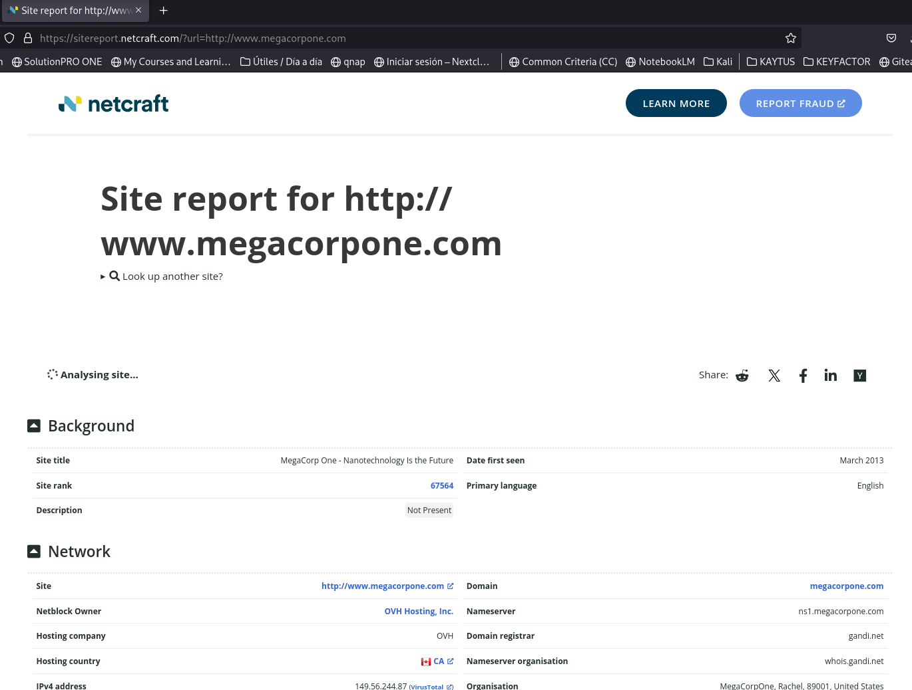
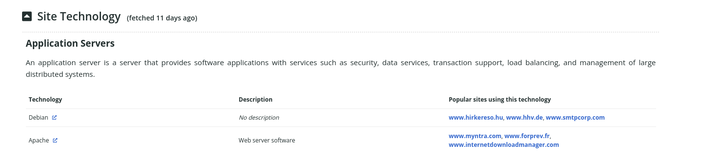

2. What is the name of the _Client-Side Scripting Framework_ that handles fonts?

.png)

3. What is the value of the _IPv4 autonomous systems_ number that hosts **www.megacorpone.com**?

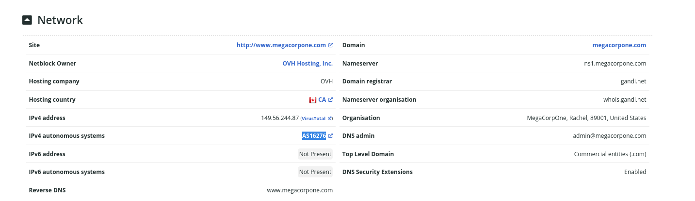

---
---
#### LABS - Open-source Code

1. Perform open-source recon on the MegaCorp One's GitHub repository and try to find user credentials. What is the username associated with the discovered hash?

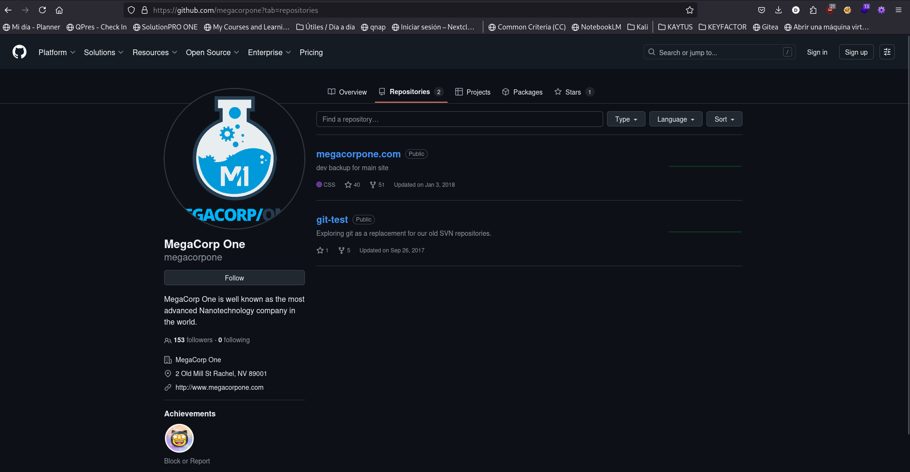

2. What is the title of the secondary, placeholder, Megacorp One repository?


---
---

#### LABS - DNS Enumeration
1. Perform a DNS enumeration on the MX records of megacorpone.com: which is the second-to-best priority value listed in the reply? The DNS priority it's a 2-digit number and lower priority values indicate higher preference.

```bash
host -t mx megacorpone.com
```

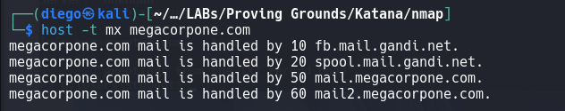

2. How many TXT records are associated with the megacorpone.com domain?

```bash
host -t txt megacorpone.com
```

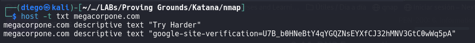

3. Automate the DNS enumeration of the megacorpone.com domain with _DNSEnum_. What is the IP of the **siem.megacorpone.com** host?

```bash
dnsenum megacorpone.com
```

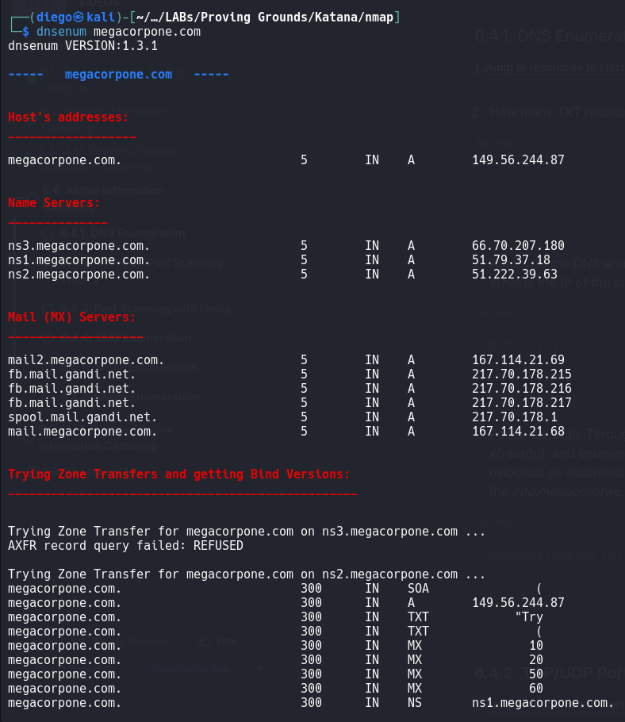

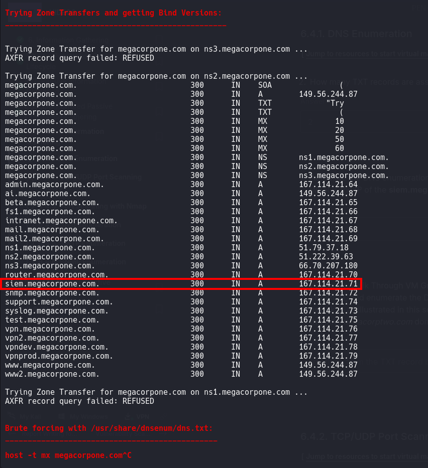

4. Power up 'Walk Through VM Group 1', connect to the Windows 11 Client (using xfreerdp), and enumerate the DNS _megacorptwo.com_ and its subdomains through nslookup as illustrated in this section. What text is contained within the TXT record of the _info.megacorptwo.com_ domain?

```bash
xfreerdp3 /u:student /p:lab /v:192.168.203.152
```

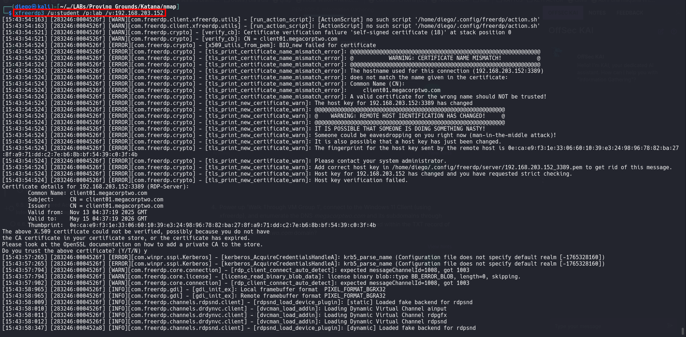

```powershell
nslookup.exe megacorptwo.com

nslookup.exe -type=TXT info.megacorptwo.com
```

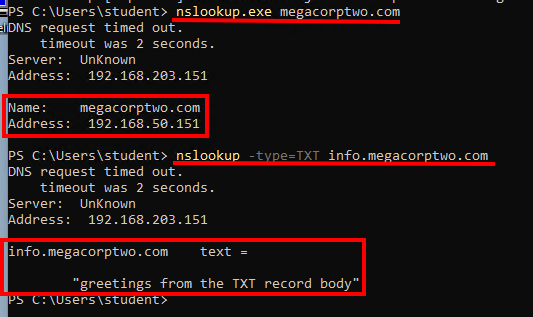

---
---

#### LABS - TCP/UDP Port Scanning

1. Once VM Group 1 is started, perform a Netcat scan against the machine ending with the octet '151' (ex: 192.168.51.151) Which is the lowest TCP open port?

```bash
nc -zvn 192.168.203.151 1-1024
```

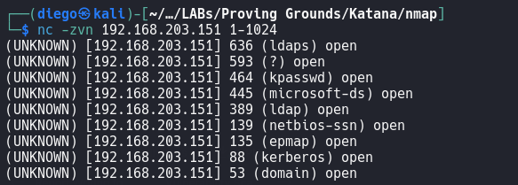

2. On the same host, perform a netcat TCP scan for the port range 1-10000. Which is the highest open TCP port?

```bash
nc -zvn 192.168.203.151 1-10000
```

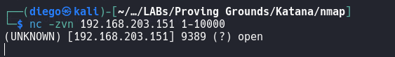

3. Other than port 123, what is the first returned open UDP port in the range 150-200 when scanning the machine ending with the octet '151' (ex: 192.168.51.151)?

```bash
nc -u -zvn 192.168.203.151 150-200
```

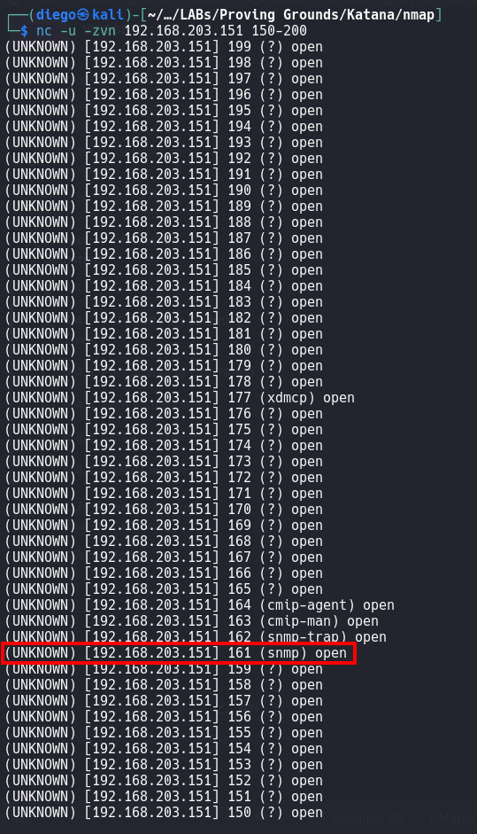

---
---
#### LABS - Port Scanning with NMAP

1. Start Walk Through Exercises in VM Group 1, use Nmap to conduct a SYN stealth scan of your target IP range, and save the output to a file. Use grep to show machines that are online. Which host has port 25 open? Use _50_ as the third IP octet instead of your dynamically assigned IP when submitting the answer.

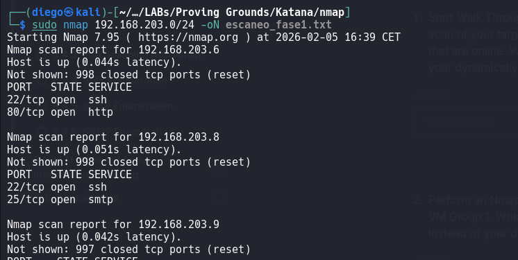
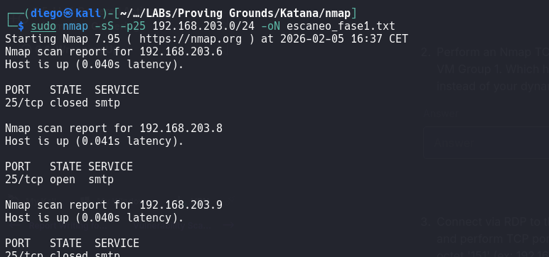
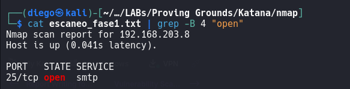

2. Perform an Nmap TCP scan against the addresses on the Walk Through Exercises on VM Group 1. Which host is running a WHOIS server? Use _50_ as the third IP octet instead of your dynamically assigned IP when submitting the answer.

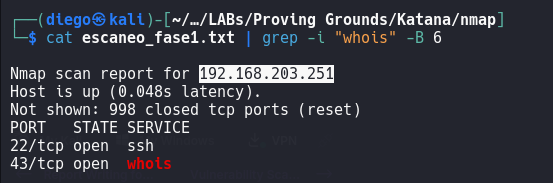

3. Connect via RDP to the Windows 11 client from Walk Through Exercises VM Group 1 and perform TCP port discovery against the Windows DC machine ending with the octet '151' (ex: 192.168.51.151). Which are the first four open TCP ports? List the ports separated by commas.


4. There is a service running on a high-range TCP port on Information Gathering - Port Scanning - Module Exercises - VM #1. Find it, and you will find the flag together with it.


5. The NMAP Scripting Engine includes a many extremely useful scripts to assist in the active recon process for a wide variety of things, not just the handful of services discussed in this Module. In the NMAP library, for example, there are over 100 NSE discovery scripts. For this challenge, you will need to use a new discovery script to help you enumerate the _HTTP title_ of the default page of all the hosts with web servers on the public lab network. Performing something as simple as scanning the web server titles can help you collect all sorts of information about the target, including the purpose of the website, software version information, and even login pages. In this challenge, you need to find the host with a web server with the title "Under Construction" in the Module Exercises VM Group 1. The flag is located on the `index.html` page of the web server matching this title.


---
---
#### LABS - SMB Enumeration

1. Power on the Walk Through VM Group 1 and use Nmap to create a list of the SMB servers in the VM Group 1. How many hosts have port 445 open?

2. On the same group, connect to the Windows 11 client and repeat the shares enumeration against dc01 via the `net view` command. What are the three reported admin shares? List them separated by commas, without spaces in between.

3. Server message block (SMB) is an extremely important service that can be used to determine a wealth of information about a server, including its users. Start up _Topic Exercise VM Group 1_ and use Nmap to identify the lab machines listening on the SMB port and then use _enum4linux_ to enumerate those machines. In doing so, you will find a machine with the local user _alfred_. The flag is located in the comments on one of the SMB shares of the host that has the _alfred_ user.


---
---
#### LABS - SMTP Enumeration

1. Power on the Walk Through Exercises VM Group 1 and search your target network range to identify any systems that respond to SMTP. Once found, open a connection to port 25 via Netcat and run _VRFY_ command against the _root_ user. What response code does the SMTP server send as a response?


---
---
#### LABS - SNMP Enumeration

1. Scan your target network on VM Group 1 with onesixtyone to identify any SNMP servers. Once done, list all the running process on the only Windows host that is running an SNMP server. What is the full name of the SNMP server process?

2. On the same Windows host, run one of the SNMP query we have already explored in this section. This time appending the `-Oa` parameter to the command. This parameter will automatically translate any hexadecimal string into ASCII that was otherwise not decoded. What is the first Interface name listed in the output?

---
---


