#
##

nmap 
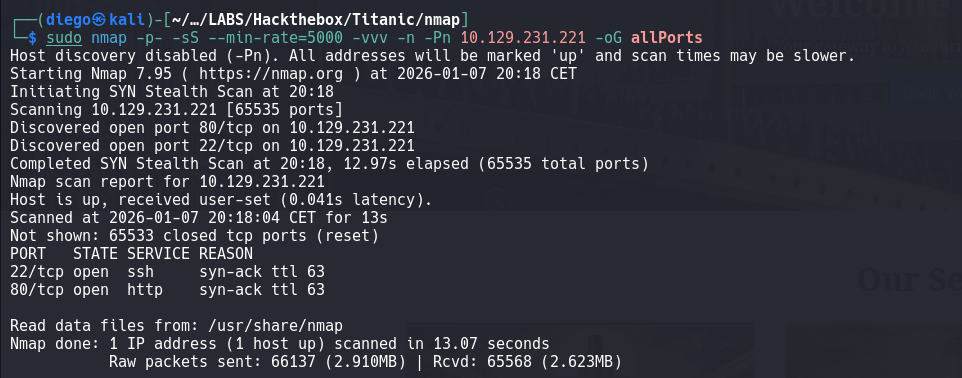
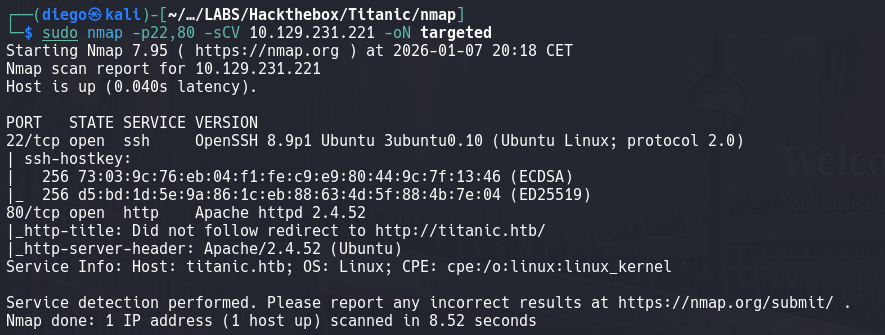

### Web
para acceder a la web --> 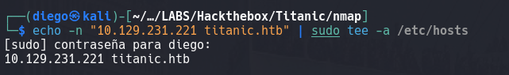 (pero con la ip correcta que tuve que cambiarla varias veces)
ahora bien, la web cómo es, enumeración
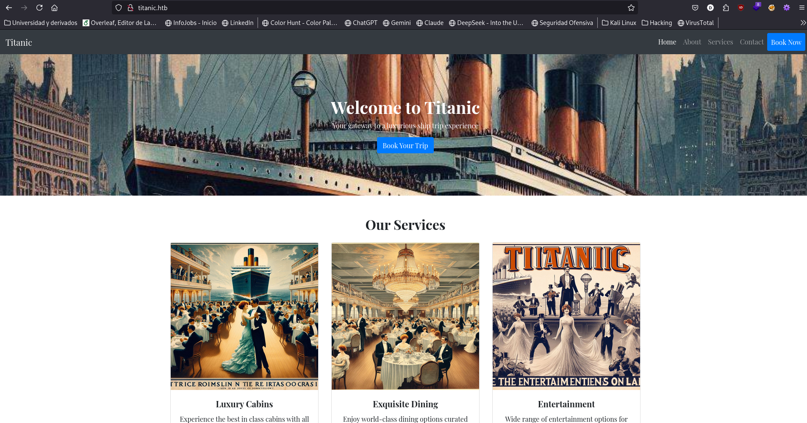
la única de las opciones así de botones y demás que parece tener algo de contenido es la de "book trip" o similares que te despliega esto --> 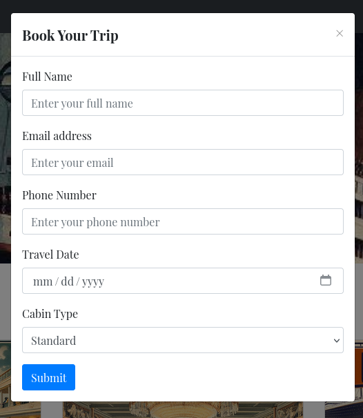
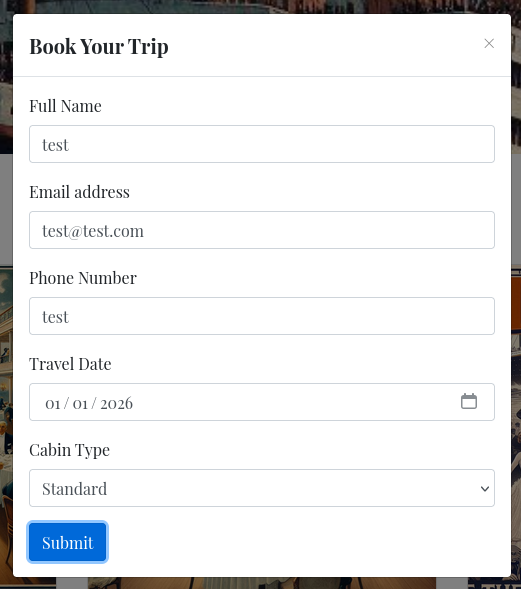
al rellenar los datos genera un json para descargar: 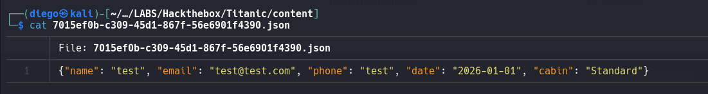
se estará procesando algo por detrás que no sepamos? **Burpsuite** --> 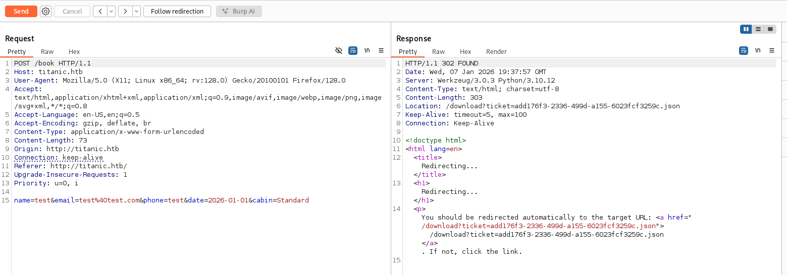
siguiendo el redirect --> 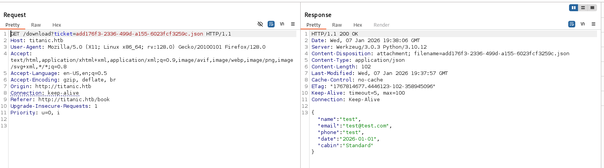
si probamos a quitar los campos de la petición también se crea y funciona el proceso, lo cual no sé si es relevante pero al menos es curioso: 
- 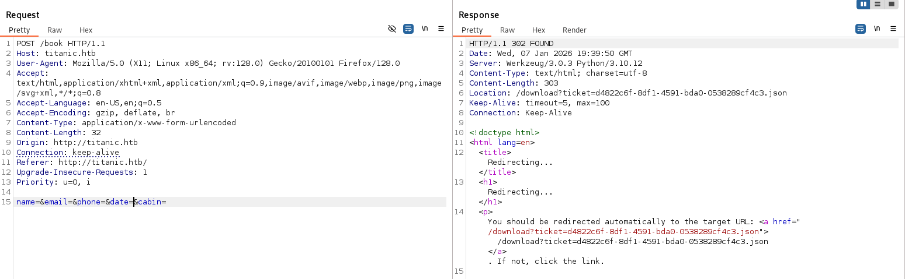
- 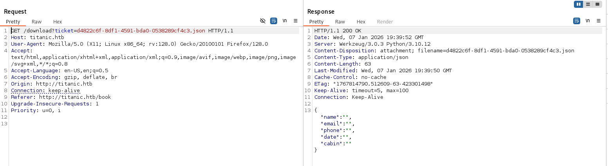

no parece que haya mucha más chicha en esta página y el form ese no tiene pinta de dar mucho juego, así que vamos a investigar posibles subdirectorios
- encontramos el de book que es del que tira para hacer el form ese que hemos visto
- pero no parece que haya más subdirectorios

Lo siguiente a mirar entonces es subdominios: 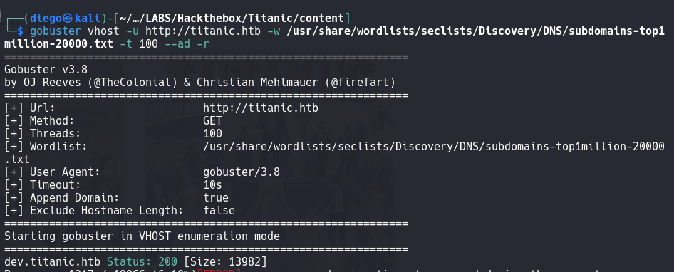
encontramos uno de desarrollo, pinta que es el camino, lo añadimos también al /etc/hosts y a ver qué nos muestra esta nueva web: 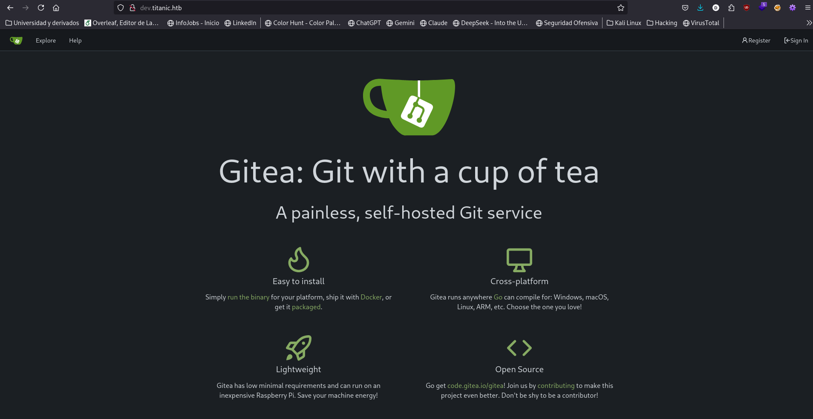
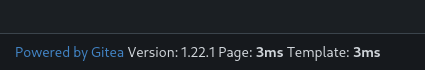
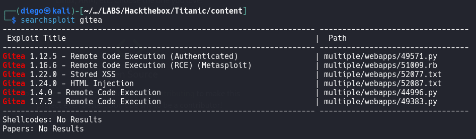

no parece que la versión en sí misma sea la vía para entrar a la máquina víctima pero tenemos esa html injection que habrá que investigar. Sigamos explorando
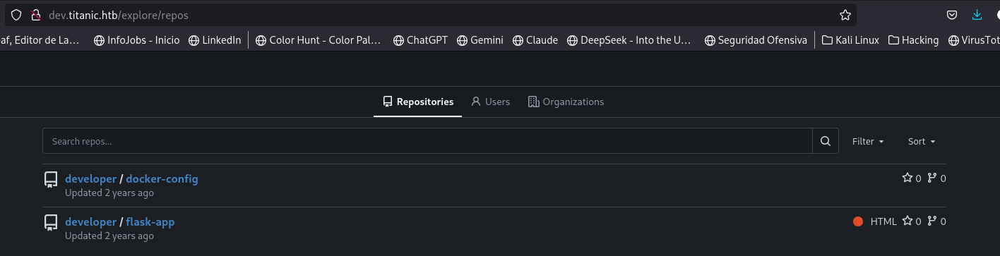
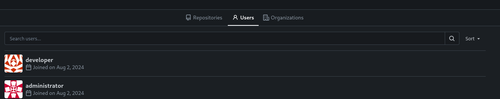
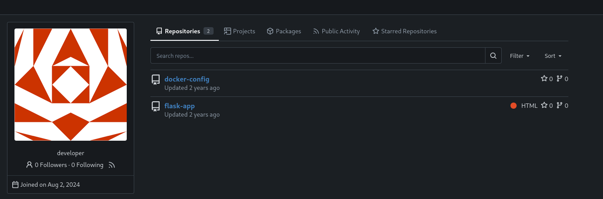

exploremos los proyectos un poco más
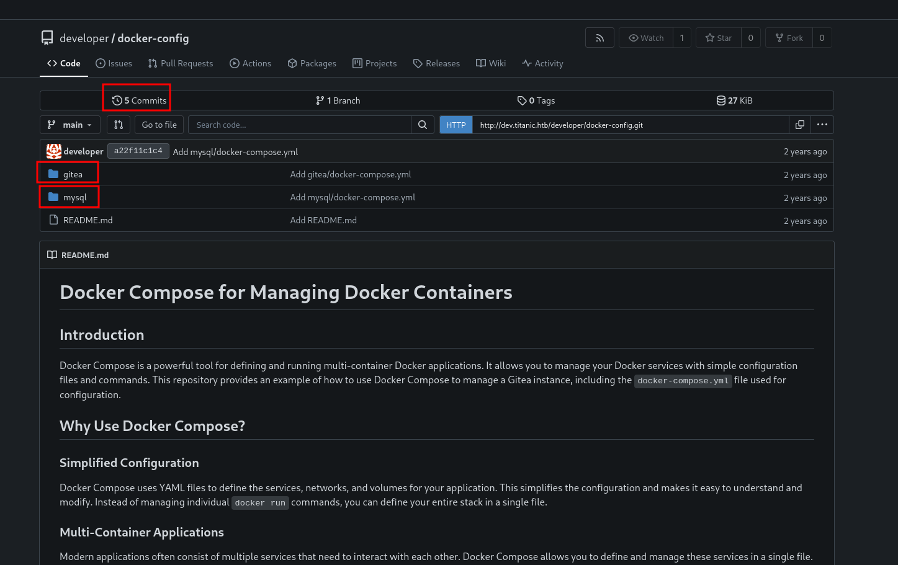
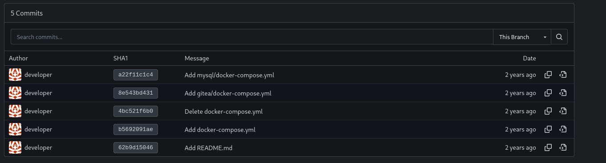
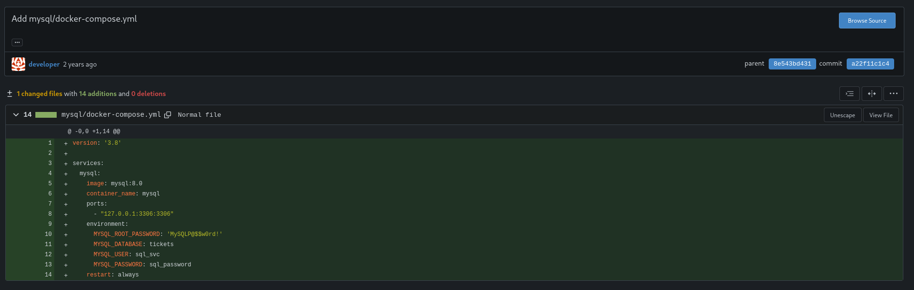
revisando todos los commits el más interesante es el de mysql que contiene credenciales que pueden ser útiles, quizás para reutilizar en el ssh o internamente en la máuqina para acceder a la base de datos que haya

Con respecto a la otra app que había vemos que está relacionada con el form que habíamos rellenado en al página de titanic, así que quizás haya información interesante de nuevo en los commits, versiones y tecnologías o en el propio código de la app
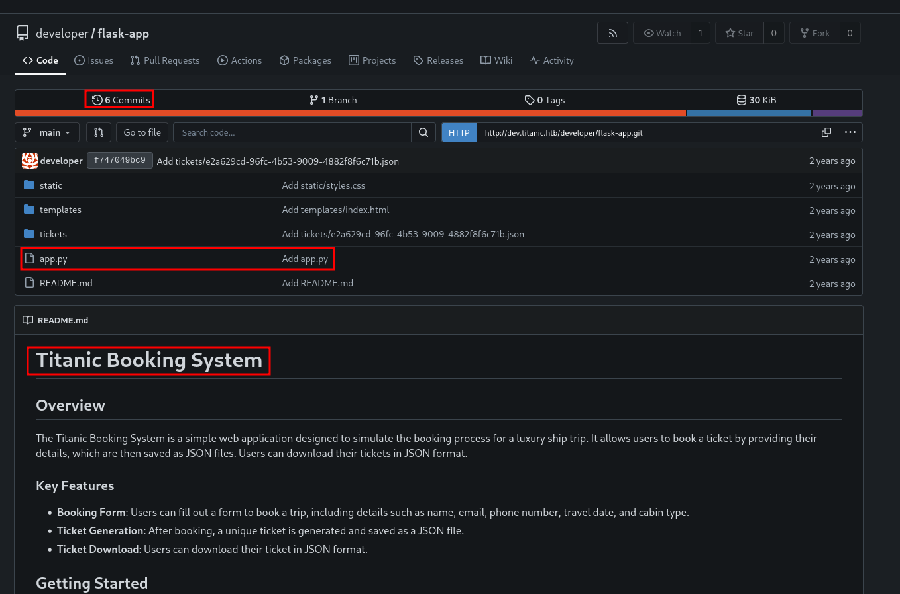

