nmap 
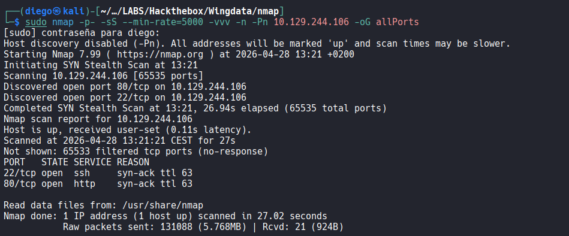
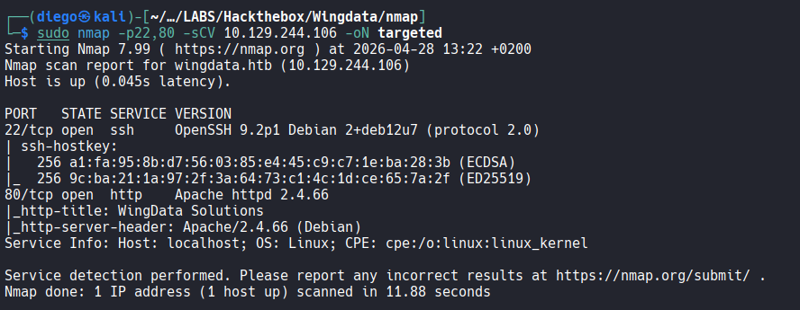

visto lo visto veamos la web:
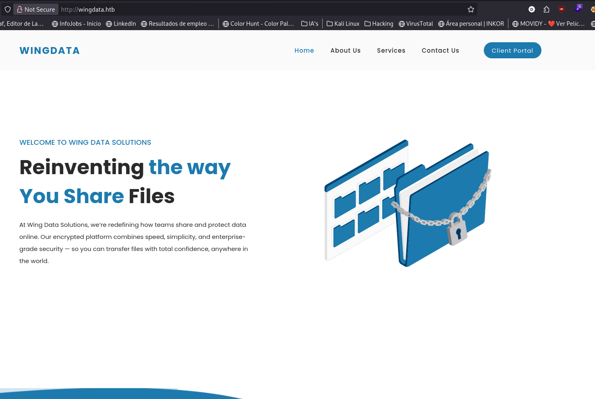
lo primero que podría llamar la atención de la página era la navbar, por ver si nos redirecciona a otras páginas, a secciones o lo que sea y dentro de esta destacar la sección de contacto que tenía el típico formulario y podría ser útil para XSS y sobre todo y por donde vamos a empezar a investigar esa sección _Client Portal_ que nos mandaba a un subdominio ``ftp.wingdata.htb``

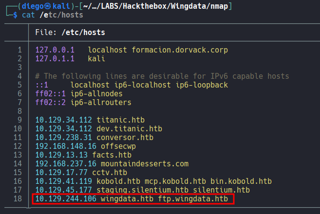
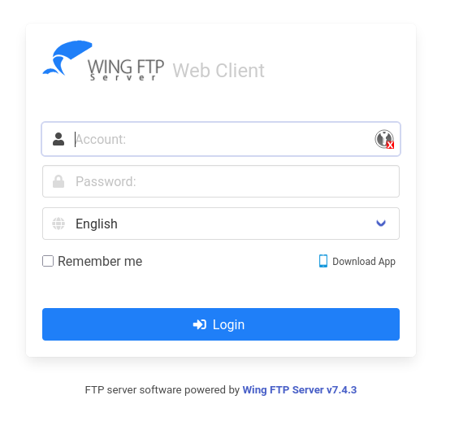
tal y como vemos se indica un software y una versión y quizás podemos encontrar vulnerabilidades asociadas, vamos a buscar:
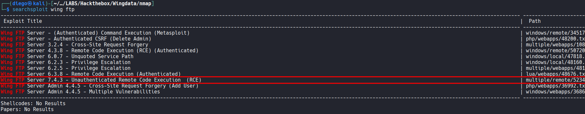
parece que existe un RCE sin autenticación para esta versión así que vamos a por ello, pinta bien:
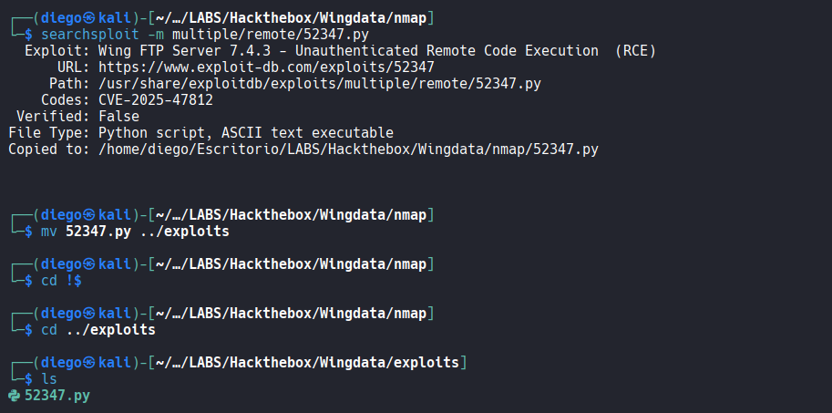
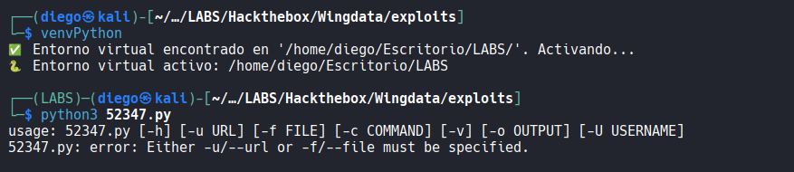
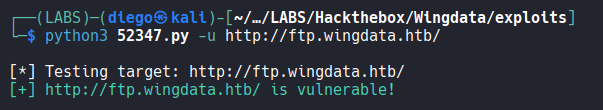

es vulnerable, a ver entonces si podemos ejecutar comandos, que parece que sí:
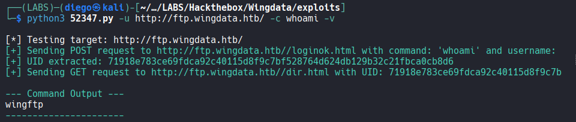
pues visto esto vamos a lanzarnos una reverse shell
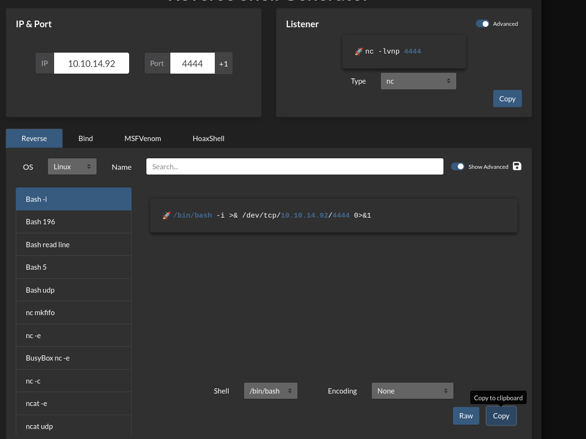
probé con la clásica y no funcionaba, probé entonces con la de mkfifo y tampoco y tuve el darmecuenta de que estábamos enviando esta información en peticiones POST, así que quizás faltaba urlencodearla 
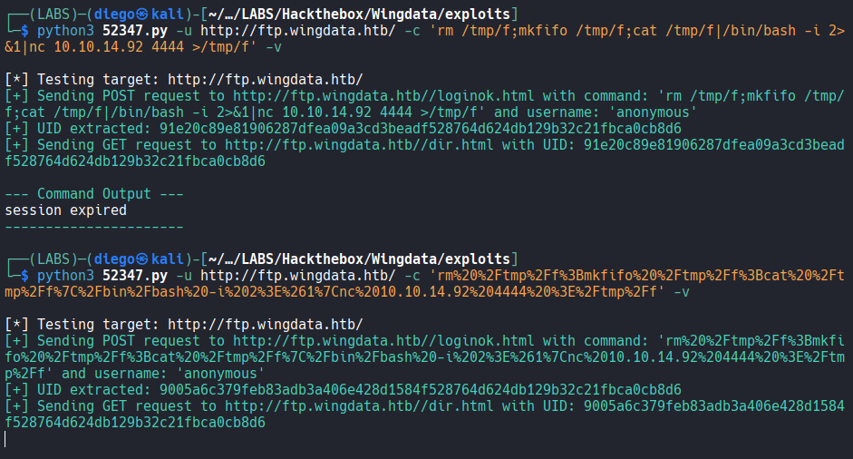
con la bash de mkfifo urlencoded si que funcionó, ahora tenemos una reverse shell vamos a por las flags:
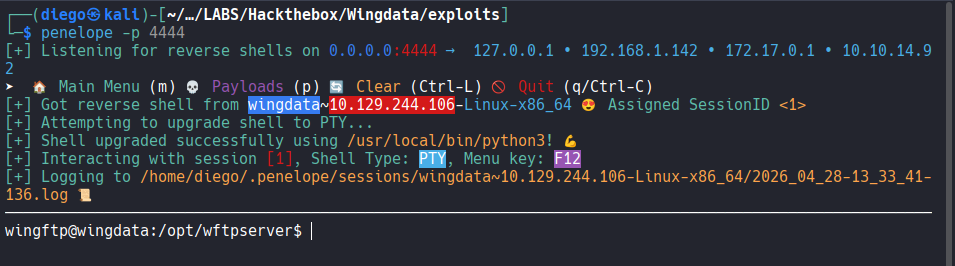
no parece que desde este user podemos leer la flag, así que toca primero investigar qué más usuarios existen, qué permisos tenemos en este y cómo podemos migrar
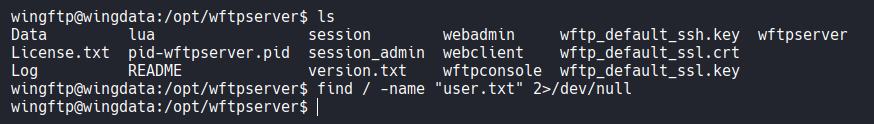
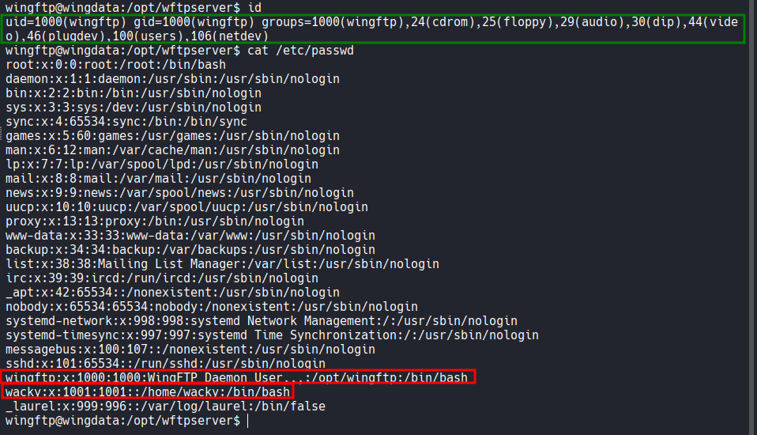

vale, en vista de que el usuario que tenemos no tiene grandes acciones ni grupos raros, ni si quiera tiene una carpeta home asignada voy a pensar que lo que haya que hacer debe estar en la carpeta donde aparecimos al spawnear la reverse shell, al carpeta del servicio, así que de alguna manera debe haber credenciales o algo con lo que migrar de usuario, así que vamos a buscar:
mirando un poco por encima encuentro esto, que parece el hash de un admin, e intento averiguar el tipo de hash que es y crackearlo.
Según hash-identifier era un sha256, aunque ahora bien, qué formato es este en hashcat? tiene salt? hmac? hay que investigarlo:
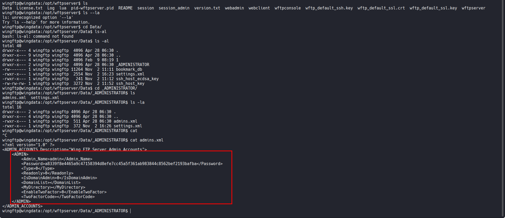
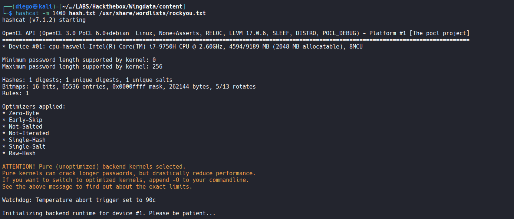
probando sin salt parece que no funciona, pero si tuviera salt cuál sería?
además, quizás sea porque es la pass de admin y no podemos crackearla, habrá alguna otra? --> 
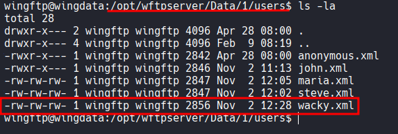
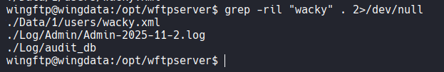

investigando un poco en la propia documentación del software vemos que las contraseñas tienen encriptación sha256 y la posibilidad de tener un salt que tal y como la aparece en la imagen parece que de forma predeterminada podría ser WingFTP --> así que si guardamos ahora los hashes que tenemos con este formato hash:salt podemos probar también formatos de hashcat como 1410 o 1420 (salt:hash) para ver si no funciona con 1400 y con esas opciones sí:
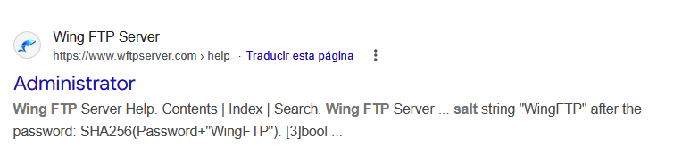

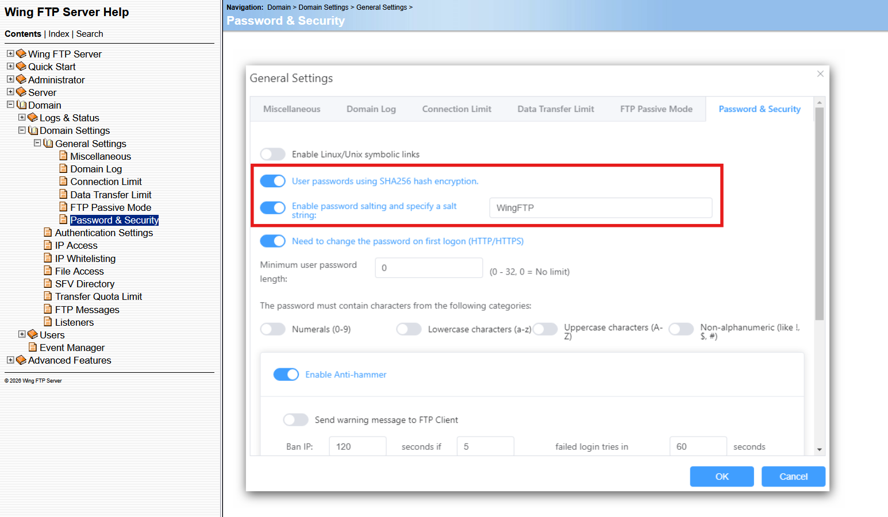
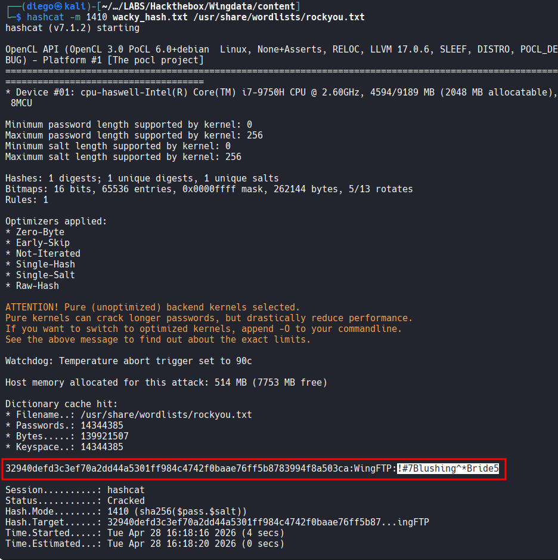
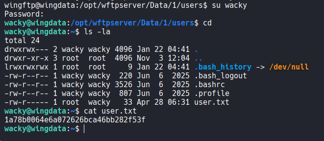